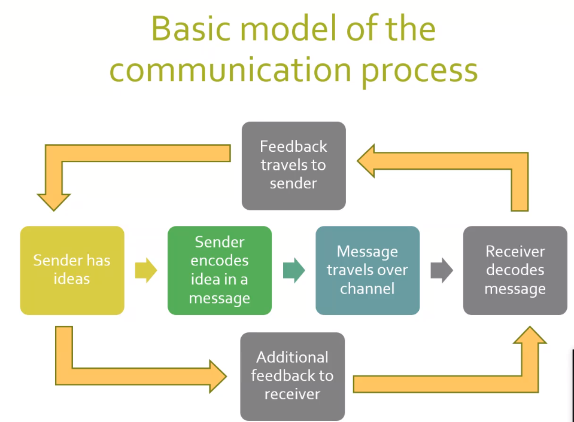

First Levels of Communication

	-  IntraPersonalCommunication:
		- is communication that occurs in your own mind. It is "self-talk"
		  which are the inner speech or mental conversation that we carry on
		  with ourselves. It is the basis of your feeeling
	- Interpersonal:
		- between two people
	- One to Group
	- Small Group
	- MassCommunication
