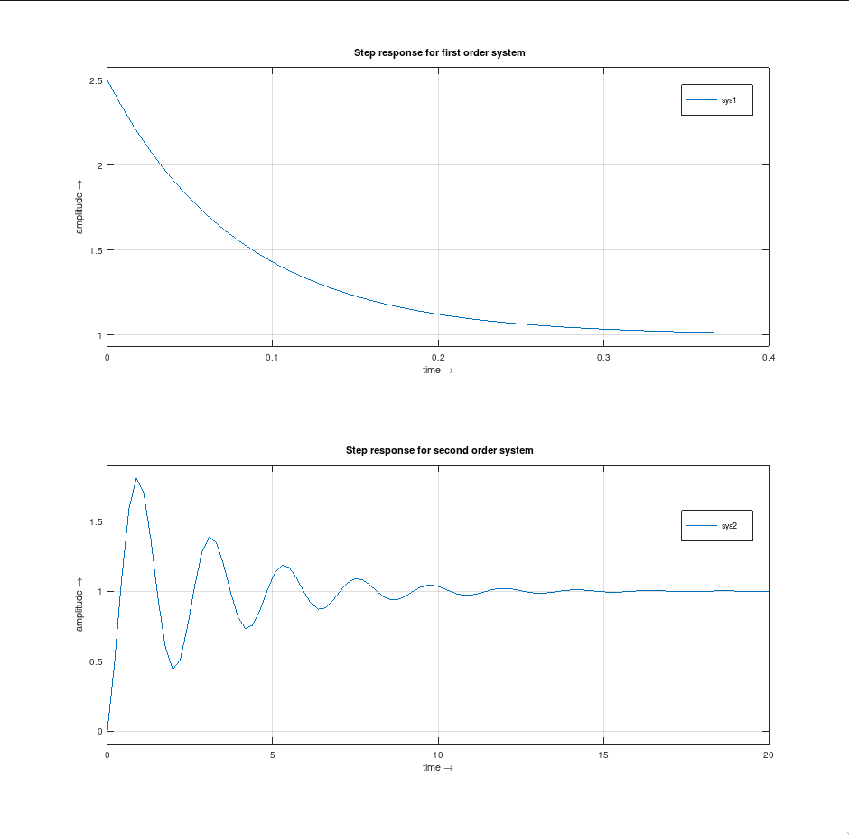

---
geometry:
    - top=2cm
    - left=2cm
    - right=2cm
    - bottom=2cm
documentclass: article
header-includes:
    - \usepackage{multicol}
    - \newcommand{\hideFromPandoc}[1]{#1}
    - \hideFromPandoc{
        \let\Begin\begin
        \let\End\end
      }
    - \usepackage{listings}
    - \usepackage{color}
    - \definecolor{dkgreen}{rgb}{0,0.6,0}
    - \definecolor{gray}{rgb}{0.5,0.5,0.5}
    - \definecolor{mauve}{rgb}{0.58,0,0.82}
pagestyle:
    - empty
---

## Code


```octave
pkg load control

clc;
clear alll;
close all;

num = [5 25];
deno1 = [2 25];
deno2 = [3 2 25];

sys1 = tf(num, deno1);
sys2 = tf(num, deno2);

subplot(2, 1, 1);
step(sys1);
xlabel('time \rightarrow')
ylabel('amplitude \rightarrow')
title(' Step response for first order system')

subplot(2, 1, 2);
step(sys2);
xlabel('time \rightarrow')
ylabel('amplitude \rightarrow')
title(' Step response for second order system')
```
## Output

{width=50%}
