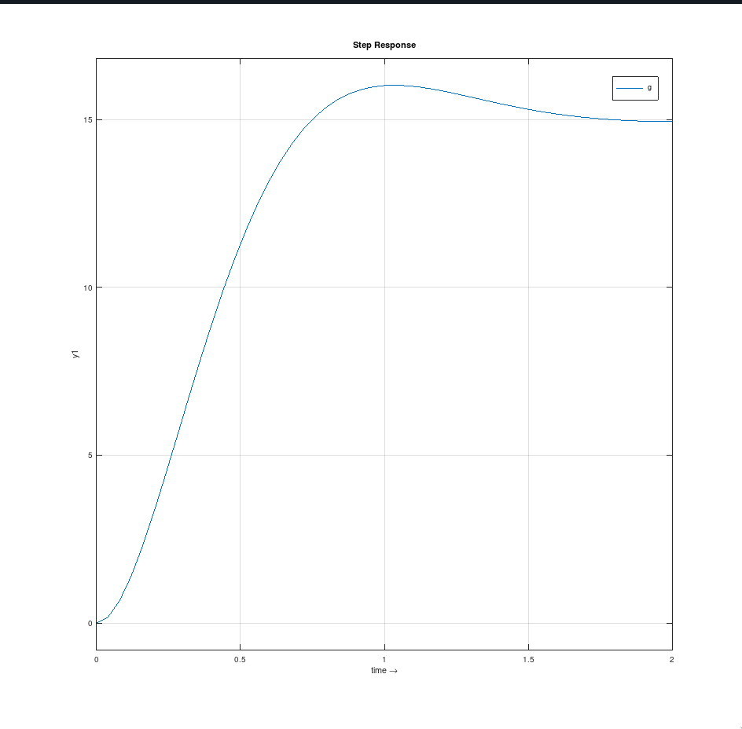

---
geometry:
    - top=2cm
    - left=2cm
    - right=2cm
    - bottom=2cm
documentclass: article
header-includes:
    - \usepackage{multicol}
    - \newcommand{\hideFromPandoc}[1]{#1}
    - \hideFromPandoc{
        \let\Begin\begin
        \let\End\end
      }
    - \usepackage{listings}
    - \usepackage{color}
    - \definecolor{dkgreen}{rgb}{0,0.6,0}
    - \definecolor{gray}{rgb}{0.5,0.5,0.5}
    - \definecolor{mauve}{rgb}{0.58,0,0.82}
pagestyle:
    - empty
---

## Code


```octave
pkg load control

clc;
clear alll;
close all;

k = 15; % open loop gain
z = 0.65;
wn = 4;

num = [k*wn*wn]
den = [1 2*z*wn wn*wn]

g = tf(num, den)
step(g)
xlabel('time \rightarrow')

wd = wn * sqrt( 1 - z*z)
fi = atan(sqrt(1 - z*z)/z)
tr = (pi -fi)/wd
tp = pi/wd
ts = 4/(z*wn)

pause
```

## Output

```
num =  240
den =

    1.0000    5.2000   16.0000


Transfer function 'g' from input 'u1' to output ...

            240
 y1:  ----------------
      s^2 + 5.2 s + 16

Continuous-time model.
wd =  3.0397
fi =  0.86321
tr =  0.74953
tp =  1.0335
ts =  1.5385
```



