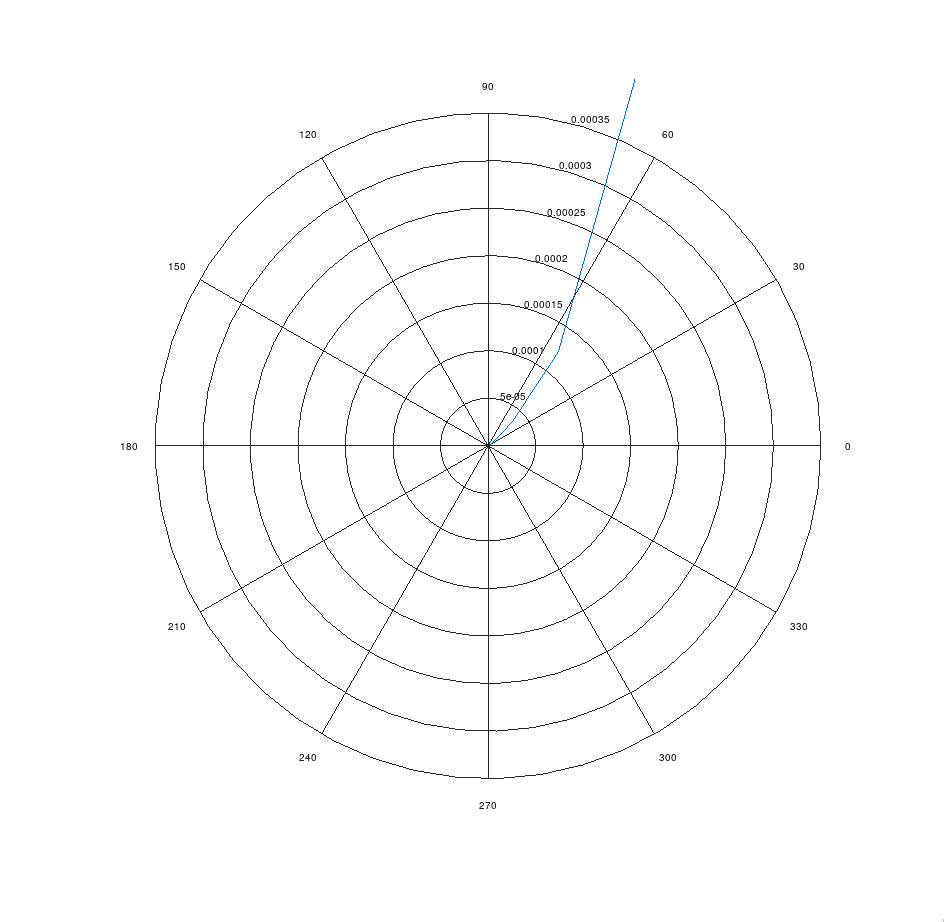

---
geometry:
    - top=2cm
    - left=2cm
    - right=2cm
    - bottom=2cm
documentclass: article
header-includes:
    - \usepackage{multicol}
    - \newcommand{\hideFromPandoc}[1]{#1}
    - \hideFromPandoc{
        \let\Begin\begin
        \let\End\end
      }
    - \usepackage{listings}
    - \usepackage{color}
    - \definecolor{dkgreen}{rgb}{0,0.6,0}
    - \definecolor{gray}{rgb}{0.5,0.5,0.5}
    - \definecolor{mauve}{rgb}{0.58,0,0.82}
pagestyle:
    - empty
---


## Code

```octave
pkg load control

w = 0:10:100;
x1 = w.*w;
x2 = sqrt((w.*w)+10)
phase = 90 - atan(w/10);
mag = 1./(x1.*x2)
num = [1];
den = [1 10];
sys = tf(num, den)
polar(phase, mag)

pause
```
## Output

{width=70%}
