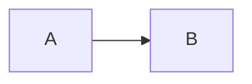

## Feedback Systems

## Block Diagram

Mathematical Relationship between systems

## Summing Point

- by circle
- operation like summing difference

## Branch Point

- signal movemenet from this point
