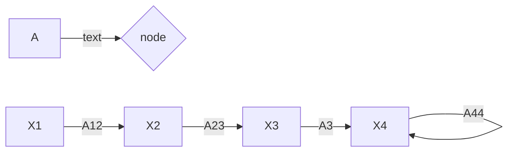

- Node-source/ sink, input/output/mixed
- transmittance- Real gain or complex gain between two nodes
- branch - line segment joing the two node with a specific direcition
- path - forward path/ closed path or feedback path
- loop - closed path
- loop gain -

Mason's Gain Formula:

[Mason Gain's Formula Link](https://electronicscoach.com/masons-gain-formula.html)

$$
	P = \frac{1}{\Delta} \sum_k P_k \Delta_k
$$

1. A23A32
2. A23A34A44
3. A23A34A45A5
4. A44
5. A2A35A52

---

1. A23A32.A44
2. A23A35A52A44

$$
P = \frac{{\sum_k P_k} \Delta_k}{\Delta}
$$

$$
\frac{P_1\Delta_1 + P_2\Delta_2}{\Delta}
$$
