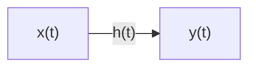
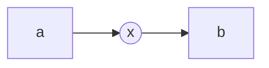

# Transfer Function

$$
    Y(t) = x(t) \circledast h(t) \\
    X(s) \times H(s) = Y(s)
$$

**Applicable for LTI Systems only**
**All Initial conidition should be zero**

$$
 G(s) = \frac{L\{Output\}}{L\{Input\}}, at\ zero \ inital \ condition
$$

\pagebreak

\pagebreak

## Block Diagram Reduction Techniques

1. Cascading of Block in series.:

2. Cascading of Blocks in Paralled:

3. Feedback Path:

4. Moving the take off point after/ before a block:

5. Moving the summing point:

6. Splitting/ Joining of Summing Points:

7. Moving a Take-off Point After / before a summing Points:

8. Exchaging of Two Summing Point
	- Can be easily changed with no effect
