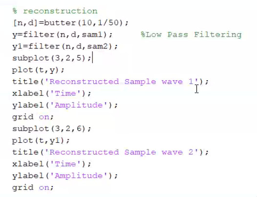
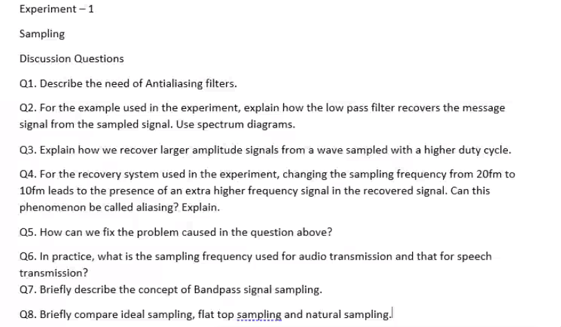

# Experiment 1

**Aim:** Sampling

[Stream Recording](https://web.microsoftstream.com/video/e0263dab-f7f3-4352-823d-6cc965dbc038)

sampling time

duty cycle= hight time/ total time * 100, percentage value is the duty cycle

sqaure wave is 50% duty cycle

$$
m(t) = A cos (2\pi f_m t)
$$

Impluse train

$$
\delta_{T_s}(t) = \sum_{n} \delta(t-nT_s)
$$

$$
p_{T_s} = \sum_n p(t-nT_s)
$$

where p(t) is a finite width pulse.

Sampled signal $m(nT_s) = m(t) \times p_{T_s}(t)$

1.
2.
