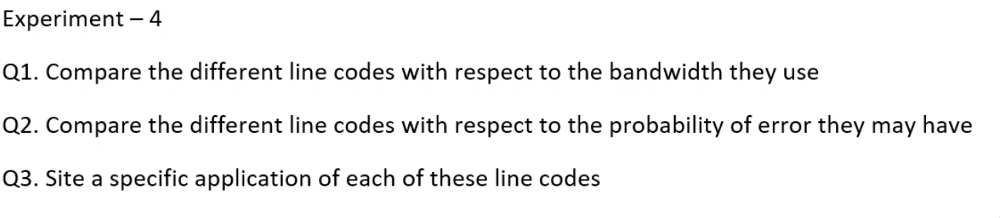
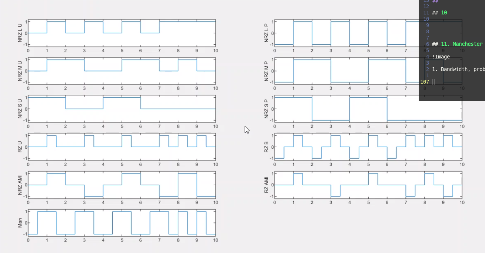

# Lab-4

Aim: Line Codes

NRZ FAMILY:

1. NRZ-L unipolar
2. NRZ-L Polar
3. NRZ-M Unipolar
4. NRZ-M Polar
5. NRZ-S Unipolar
6. NRZ-S Polar
7. NRZ-AMI

RZ FAMILY:

1. RZ unipolar
2. RZ bipolar

MANCHESTER:

1. Bi -$\phi$ -L

## 1. NRZ-L unipolar

$$
s(t) = \left\{\begin{array}{lr}
	1, & for\ 0 \rightarrow T_b if\ b[nT_b] =1 \\
	0, & for\ 0 \rightarrow T_b if\ b[nT_b]=0
	\end{array}\right\}
$$

## 2. NRZ-L Polar

$$
s(t) = \left\{\begin{array}{lr}
	1, & for\ 0 \rightarrow T_b if\ b[nT_b] =1 \\
	-1, & for\ 0 \rightarrow T_b if\ b[nT_b]=0
	\end{array}\right\}
$$

## 3. NRZ-M Unipolar

1. Mark based differential encoding (XOR) and create $mark[nT_b]$
2.
$$
s(t) = \left\{\begin{array}{lr}
	1, & for\ 0 \rightarrow T_b if\ b[nT_b] =1 \\
	0, & for\ 0 \rightarrow T_b if\ b[nT_b]=0
	\end{array}\right\}
$$

## 4. NRZ-M Polar

1. Mark based differential encoding (XOR) and create $mark[nT_b]$
2.
$$
s(t) = \left\{\begin{array}{lr}
	1, & for\ 0 \rightarrow T_b if\ b[nT_b] =1 \\
	-1, & for\ 0 \rightarrow T_b if\ b[nT_b]=0
	\end{array}\right\}
$$

## 5. NRZ-S Unipolar

1. Space Based differential encoding (XNOR) and create $space[nT_b]$
2.
$$
s(t) = \left\{\begin{array}{lr}
	1, & for\ 0 \rightarrow T_b if\ b[nT_b] =1 \\
	0, & for\ 0 \rightarrow T_b\ if\ b[nT_b]=0
	\end{array}\right\}
$$

## 6. NRZ-S Polar

1. Space Based differential encoding (XNOR) and create $space[nT_b]$
2.
$$
s(t) = \left\{\begin{array}{lr}
	1, & for\ 0 \rightarrow T_b if\ b[nT_b] =1 \\
	-1 , & for\ 0 \rightarrow T_b\ if\ b[nT_b]=0
	\end{array}\right\}
$$

## 7. NRZ-AMI

$$
s(t) = \left\{\begin{array}{lr}
	\pm 1, & for\ 0 \rightarrow T_b \ if\ b[nT_b] =1, \text{where sign toggles for every occurance of 1} \\
	0 , & for\ 0 \rightarrow T_b\ if\ b[nT_b]=0
	\end{array}\right\}
$$

## 8. RZ-Unipolar

$$
s(t) = \left\{\begin{array}{lr}
	1, & for\ 0 \rightarrow \frac{t_b}{2} \ if\ b[nt_b] =1 \\
	0, & for \frac{t_b}{2} \rightarrow t_b \\
	0, & for\ 0 \rightarrow t_b if\ b[nt_b]=0
	\end{array}\right\}
$$

## 9. RZ-Bipolar

$$
s(t) = \left\{\begin{array}{lr}
	1, & for\ 0 \rightarrow \frac{t_b}{2} \ if\ b[nt_b] =1 \\
	0, & for \frac{t_b}{2} \rightarrow t_b \\
	-1, & for\ 0 \rightarrow \frac{t_b}{2} \ if\ b[nt_b] =0 \\
	0, & for\ 0 \rightarrow \frac{t_b}{2} \ if\ b[nt_b] =0 \\
	\end{array}\right\}
$$

## 10. RZ-AMI

$$
s(t) = \left\{\begin{array}{lr}
	\pm 1, & for\ 0 \rightarrow \frac{T_b}{2} \ if\ b[nT_b] =1, \text{where sign toggles for every occurance of 1} \\
	0 , & for\ \frac{T_b}{2} \rightarrow T_b \ if\ b[nT_b]=0 \\
	0 , & for\ 0 \rightarrow T_b\ if\ b[nT_b]=0
	\end{array}\right\}
$$

## 11. Manchester

$$
s(t) = \left\{\begin{array}{lr}
	1, & for\ 0 \rightarrow \frac{T_b}{2} \ if\ b[nT_b] =1 \\
	-1 , & for\ \frac{T_b}{2} \rightarrow T_b \ if\ b[nT_b]=1 \\
	-1, & for\ 0 \rightarrow \frac{T_b}{2} \ if\ b[nT_b] =0 \\
	1 , & for\ \frac{T_b}{2} \rightarrow T_b \ if\ b[nT_b]=0 \\
	\end{array}\right\}
$$

1. Bandwidth, probability of error, power, selfclocking, error correction

