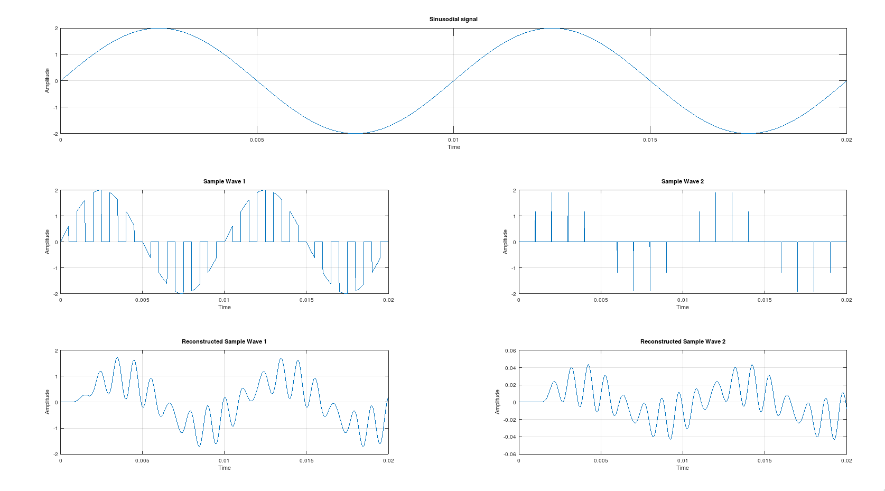

---
geometry:
    - top=1cm
    - left=2cm
    - right=2cm
    - bottom=1cm
documentclass: article
header-includes:
    - \usepackage{multicol}
    - \newcommand{\hideFromPandoc}[1]{#1}
    - \hideFromPandoc{
        \let\Begin\begin
        \let\End\end
      }
    - \usepackage{listings}
    - \usepackage{color}
    - \definecolor{dkgreen}{rgb}{0,0.6,0}
    - \definecolor{gray}{rgb}{0.5,0.5,0.5}
    - \definecolor{mauve}{rgb}{0.58,0,0.82}
pagestyle:
    - empty
---

\begin{center}
	\section{Experiment - 1}
\end{center}

**Aim:** To Study Sampling Theorem and Simulate the Above using Matlab/Octave.


\Begin{multicols}{2}

### Code

```matlab
% octave pkg to load signal based utils
pkg load signal

clc;
clear alll;
close all;


%Inputs
a = input('Enter the Amplitude: ')
fm = input('Enter the Frequency: ')

fs = 20*fm;
t = 0:1/(1000*fm):2/fm;
s = a*sin(2*pi*fm*t);

% p = (1 + square(2*pi*fs*t, 50))/2;
p = square(2*pi*fs*t, 50);
p(p<0) = 0;

p1 = (1 + square(2*pi*fs*t, 0.1))/2;

sam1 = s.*p;
sam2 = s.*p1;


% Plotting

subplot(3, 1, 1);
plot(t, s);
grid on;
title('Sinusodial signal');
xlabel('Time');
ylabel('Amplitude');

subplot(3, 2, 3);
plot(t, sam1);
grid on;
title('Sample Wave 1');
xlabel('Time');
ylabel('Amplitude');


subplot(3, 2, 4);
plot(t, sam2);
grid on;
title('Sample Wave 2');
xlabel('Time');
ylabel('Amplitude');

% Reconstruction

[n, d] = butter(10, 1/50);
y = filter(n, d, sam1);		%low Pass filtering
y1 = filter(n, d, sam2);

%Plotting

subplot(3, 2, 5);
plot(t, y);
grid on;
title('Reconstructed Sample Wave 1');
xlabel('Time');
ylabel('Amplitude');

subplot(3, 2, 6);
plot(t, y1);
grid on;
title('Reconstructed Sample Wave 2');
xlabel('Time');
ylabel('Amplitude');

%pause in octave
pause
```
\End{multicols}


## Outputs


### Case 1: Sampling With 50% duty Cycle (No aliasing)

{width=70%}

### Case 2: Sampling With 20% duty Cycle (Noise in Recovery)

{width=70%}


### Case 3: Sampling With 50% duty Cycle (Aliasing)

{width=70%}
