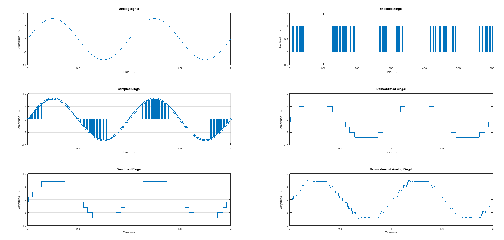
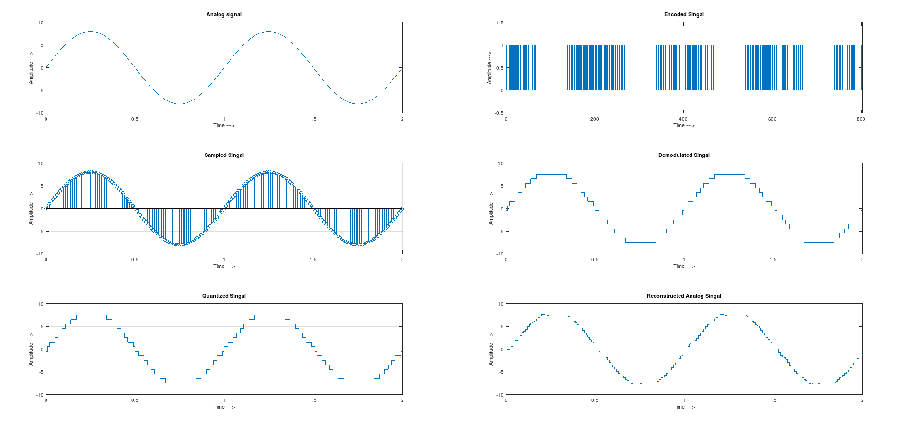
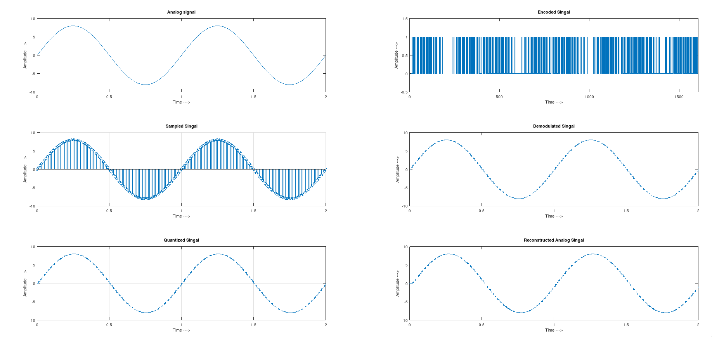

---
geometry:
  - top=1cm
  - left=2cm
  - right=2cm
  - bottom=1cm
documentclass: article
header-includes:
  - \usepackage{multicol}
  - \newcommand{\hideFromPandoc}[1]{#1}
  - \hideFromPandoc{
    \let\Begin\begin
    \let\End\end
    }
  - \usepackage{listings}
  - \usepackage{color}
  - \definecolor{dkgreen}{rgb}{0,0.6,0}
  - \definecolor{gray}{rgb}{0.5,0.5,0.5}
  - \definecolor{mauve}{rgb}{0.58,0,0.82}
pagestyle:
    - empty
---

\begin{center}
\section{Experiment - 2}
\end{center}

**Aim:** To Study Pulse Code Modulation (PCM) and Study Probability of Error
using Matlab/Octave.


\Begin{multicols}{2}

### Code

```Matlab
% octave pkg to load signal based utils
pkg load signal
pkg load communications

clc;
clear alll;
close all;

%Inputs
n = input('PCM system bits required: ')
fs = input('Sampling Rate: ')
L = 2^n;
t = 0:1/fs:2;
s = 8*sin(2*pi*t);

% Plotting

subplot(3, 1, 1);
plot(t, s);
title('Analog signal');
xlabel('Time --->');
ylabel('Amplitude --->');

subplot(3, 1, 2);
stem(t, s);
grid on;
title('Sampled Singal');
xlabel('Time --->');
ylabel('Amplitude --->');

% Quantization Process

vmax = max(s);
vmin = min(s);
del = (vmax - vmin)/L;
part = vmin + del : del : vmax - del;
code = vmin + del/2 : del : vmax - del/2;
[ind, q] = quantiz(s, part, code);

l_1 = length(ind);

subplot(3, 1, 3);
stairs(t, q);
grid on;
title('Quantized Singal');
xlabel('Time --->');
ylabel('Amplitude --->');

% Encoding process

figure

enc = de2bi(ind, n, 'left-msb');
k = 1;
for i=1:l_1
	for j=1:n
		coded(k) = enc(i, j);
		k = k + 1;
	end
end

subplot(3, 1, 1);
grid on;
stairs(0:(length(t)*n) - 1, coded);
axis([0 (length(t)*n)-1 -0.5 1.5]);
title('Encoded Singal');
xlabel('Time --->');
ylabel('Amplitude --->');

% Demodulation of PCM Signal

qunt = reshape(coded, n, length(coded)/n);
index = bi2de(qunt', 'left-msb');

q_1 = del * index + vmin + (del/2);

[n, d] = butter(5, 0.5);
de = filter(n, d, q);

subplot(3, 1, 2);
grid on;
stairs(t, q_1);
title('Demodulated Singal');
xlabel('Time --->');
ylabel('Amplitude --->');

subplot(3, 1, 3);
grid on;
stairs(t, de);
title('Reconstructed Analog Singal');
xlabel('Time --->');
ylabel('Amplitude --->');

%pause in octave
pause
```
\End{multicols}


## Outputs

### Case 1: Number of bits = 3

{width=80%}

### Case 2: Number of bits = 4

{width=80%}

### Case 3: Number of bits = 8

{width=80%}
