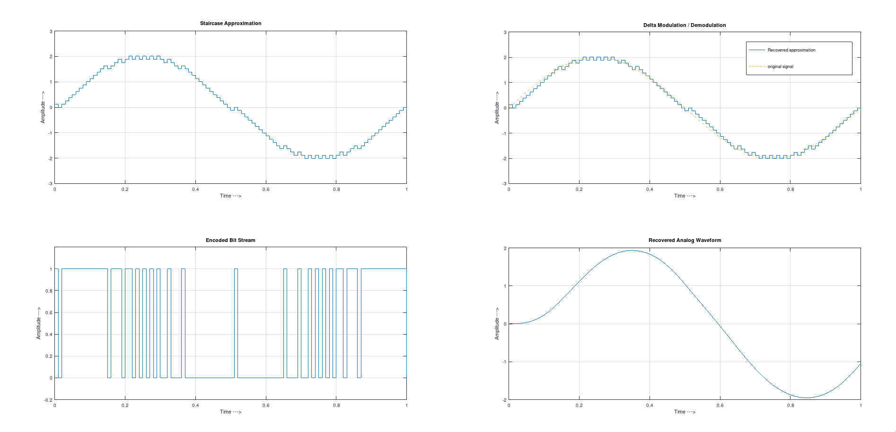
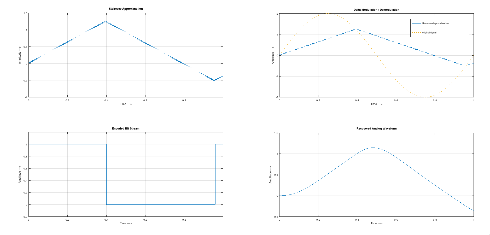
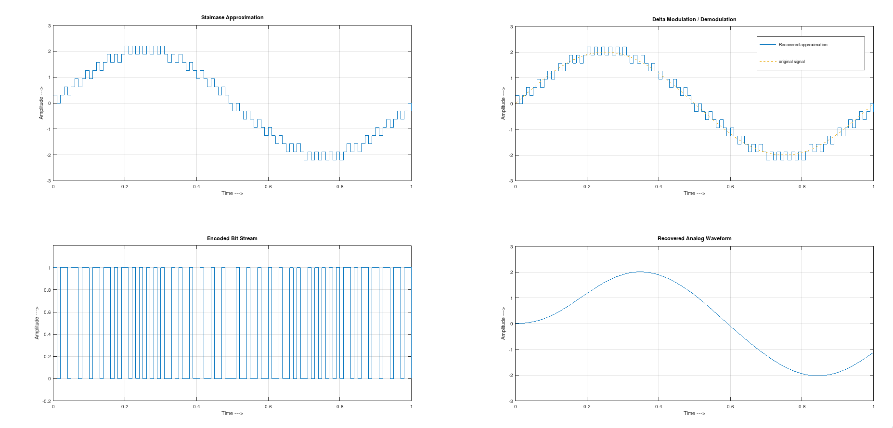

---
geometry:
  - top=1cm
  - left=2cm
  - right=2cm
  - bottom=1cm
documentclass: article
header-includes:
  - \usepackage{multicol}
  - \newcommand{\hideFromPandoc}[1]{#1}
  - \hideFromPandoc{
    \let\Begin\begin
    \let\End\end
    }
  - \usepackage{listings}
  - \usepackage{color}
  - \definecolor{dkgreen}{rgb}{0,0.6,0}
  - \definecolor{gray}{rgb}{0.5,0.5,0.5}
  - \definecolor{mauve}{rgb}{0.58,0,0.82}
pagestyle:
    - empty
---

\begin{center}
\section{Experiment - 3}
\end{center}

**Aim:** To Study Delta Modulation (DM) and Study Probability of Error
using Matlab/Octave.


\Begin{multicols}{2}

### Code

```matlab
% octave pkg to load signal based utils
pkg load signal
pkg load communications

clc;
clear alll;
close all;

%Inputs
a = 2
t = 0:1/100:1;
x = a*sin(2*pi*t);
l = length(x)
delta = input('Required Step Size: ');

%Variation of this step size results in the
% problems of delta modulation like
%  granular noise and slope overloading
% leading to improper reconstruciton

xn = 0;

for i=1:l
	if x(i) >= xn(i)
		d(i) = 1;
		xn(i+1) = xn(i) + delta;
	else
		d(i) = 0;
		xn(i+1) = xn(i) - delta;
	end
end

% Plotting

subplot(2, 1, 1);
stairs(t, xn(2:end));
grid on;
title('Staircase Approximation');
xlabel('Time --->');
ylabel('Amplitude --->');

subplot(2, 1, 2);
stairs(t, d);
grid on;
title('Encoded Bit Stream');
xlabel('Time --->');
ylabel('Amplitude --->');
ylim([-0.2 1.2])

% Recovery

r = 0;
for i=1:length(d)
	if d(i) == 0
		r(i+1) = r(i) - delta;
	else
		r(i+1) = r(i) + delta;
	end
end

[p, q] = butter(2, 1/20);
rec = filter(p, q, r);

figure
subplot(2, 1, 1);
stairs(t, r(2:end));
hold on;
plot(t, x, '--');
legend('Recovered approximation', 'original signal');
grid on;
title('Delta Modulation / Demodulation');
xlabel('Time --->');
ylabel('Amplitude --->');

subplot(2, 1, 2);
plot(t, rec(2:end));
grid on;
title('Recovered Analog Waveform');
xlabel('Time --->');
ylabel('Amplitude --->');

pause

```
\End{multicols}

\pagebreak

## Outputs:

### Case 1: Adequate Step Size $\delta = \pi/25$

{width=95%, height=25%}

### Case 2: Large Step Size $\delta = \pi/100$

{width=95%, height=25%}

### Case 3: Small Step Size $\delta = \pi/10$

{width=95%, height=25%}
