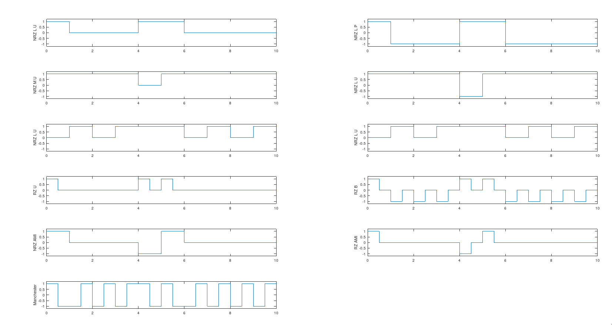

---
geometry:
    - top=1cm
    - left=2cm
    - right=2cm
    - bottom=1cm
documentclass: article
header-includes:
    - \usepackage{multicol}
    - \newcommand{\hideFromPandoc}[1]{#1}
    - \hideFromPandoc{
        \let\Begin\begin
        \let\End\end
      }
    - \usepackage{listings}
    - \usepackage{color}
    - \definecolor{dkgreen}{rgb}{0,0.6,0}
    - \definecolor{gray}{rgb}{0.5,0.5,0.5}
    - \definecolor{mauve}{rgb}{0.58,0,0.82}
pagestyle:
    - empty
---

\begin{center}
	\section{Experiment - 4}
\end{center}

**Aim:** To Study Line Codes and Implementing them in Matlab/Octave


\Begin{multicols}{2}

### NRZ FAMILY:

1. NRZ-L unipolar
2. NRZ-L Polar
3. NRZ-M Unipolar
4. NRZ-M Polar
5. NRZ-S Unipolar
6. NRZ-S Polar
7. NRZ-AMI
8. RZ-AMI

### RZ FAMILY:

1. RZ unipolar
2. RZ bipolar

### MANCHESTER:

1. Bi -$\phi$ -L

\End{multicols}

\Begin{multicols}{2}

## 1. NRZ-L unipolar

$$
s(t) = \begin{cases}
	1, & for\ 0 \rightarrow T_b \ if\ b[nT_b] =1 \\
	0, & for\ 0 \rightarrow T_b \ if\ b[nT_b]=0
	\end{cases}
$$

## 2. NRZ-L Polar

$$
s(t) = \begin{cases}
	1, & for\ 0 \rightarrow T_b \ if\ b[nT_b] =1 \\
	-1, & for\ 0 \rightarrow T_b \ if\ b[nT_b]=0
	\end{cases}
$$

\End{multicols}

\Begin{multicols}{2}

## 3. NRZ-M Unipolar

1. Mark based differential encoding (XOR) and create $mark[nT_b]$
2.
$$
s(t) = \begin{cases}
	1, & for\ 0 \rightarrow T_b \ if\ b[nT_b] =1 \\
	0, & for\ 0 \rightarrow T_b \ if\ b[nT_b]=0
	\end{cases}
$$

## 4. NRZ-M Polar

1. Mark based differential encoding (XOR) and create $mark[nT_b]$
2.
$$
s(t) = \begin{cases}
	1, & for\ 0 \rightarrow T_b \ if\ b[nT_b] =1 \\
	-1, & for\ 0 \rightarrow T_b \ if\ b[nT_b]=0
	\end{cases}
$$

\End{multicols}

\Begin{multicols}{2}


## 5. NRZ-S Unipolar

1. Space Based differential encoding (XNOR) and create $space[nT_b]$
2.
$$
s(t) = \begin{cases}
	1, & for\ 0 \rightarrow T_b \ if\ b[nT_b] =1 \\
	0, & for\ 0 \rightarrow T_b\ \ if\ b[nT_b]=0
	\end{cases}
$$

## 6. NRZ-S Polar

1. Space Based differential encoding (XNOR) and create $space[nT_b]$
2.
$$
s(t) = \begin{cases}
	1, & for\ 0 \rightarrow T_b \ if\ b[nT_b] =1 \\
	-1 , & for\ 0 \rightarrow T_b\ if\ b[nT_b]=0
	\end{cases}
$$


\End{multicols}

## 7. NRZ-AMI

$$
s(t) = \begin{cases}
	\pm 1, & for\ 0 \rightarrow T_b \ if\ b[nT_b] =1, \text{where sign toggles for every occurance of 1} \\
	0 , & for\ 0 \rightarrow T_b\ if\ b[nT_b]=0
	\end{cases}
$$


\Begin{multicols}{2}

## 8. RZ-Unipolar

$$
s(t) = \begin{cases}
	1, & for\ 0 \rightarrow \frac{t_b}{2} \ if\ b[nt_b] =1 \\
	0, & for \frac{t_b}{2} \rightarrow t_b \\
	0, & for\ 0 \rightarrow t_b \ if\ b[nt_b]=0
	\end{cases}
$$


## 9. RZ-Bipolar

$$
s(t) = \begin{cases}
	1, & for\ 0 \rightarrow \frac{t_b}{2} \ if\ b[nt_b] =1 \\
	0, & for \frac{t_b}{2} \rightarrow t_b \\
	-1, & for\ 0 \rightarrow \frac{t_b}{2} \ if\ b[nt_b] =0 \\
	0, & for\ 0 \rightarrow \frac{t_b}{2} \ if\ b[nt_b] =0 \\
	\end{cases}
$$

\End{multicols}

## 10. RZ-AMI


$$
s(t) = \begin{cases}
	\pm 1, & for\ 0 \rightarrow \frac{T_b}{2} \ if\ b[nT_b] =1, \text{where sign toggles for every occurance of 1} \\
	0 , & for\ \frac{T_b}{2} \rightarrow T_b \ if\ b[nT_b]=0 \\
	0 , & for\ 0 \rightarrow T_b\ if\ b[nT_b]=0
	\end{cases}
$$


## 11. Manchester


$$
s(t) = \begin{cases}
	1, & for\ 0 \rightarrow \frac{T_b}{2} \ if\ b[nT_b] =1 \\
	-1 , & for\ \frac{T_b}{2} \rightarrow T_b \ if\ b[nT_b]=1 \\
	-1, & for\ 0 \rightarrow \frac{T_b}{2} \ if\ b[nT_b] =0 \\
	1 , & for\ \frac{T_b}{2} \rightarrow T_b \ if\ b[nT_b]=0 \\
	\end{cases}
$$

\pagebreak

### Code


```matlab

% octave pkg to load signal based utils
pkg load signal
clc;
clear alll;
close all;
%Inputs
b = round(rand(1, 10))
t = 0 : 1/100 : 0.99;
inc = t(2) - t(1);
% Line Codes
NRZ_L_U = [];
NRZ_L_P = [];
NRZ_M_U = [];
NRZ_M_P = [];
NRZ_S_U = [];
NRZ_S_P = [];
RZ_U	= [];
RZ_B	= [];
MAN	= [];
sign = 1;
NRZ_AMI = [];
RZ_AMI  = [];
for i=1:length(b)
	if b(i) == 1
		NRZ_L_U = [NRZ_L_U ones(size(t))];
		NRZ_L_P = [NRZ_L_P ones(size(t))];
		RZ_U	= [RZ_U ones(1, length(t)/2) zeros(1, length(t)/2)];
		RZ_B	= [RZ_B ones(1, length(t)/2) zeros(1, length(t)/2)];
		MAN	= [MAN square(2*pi*t, 50)];
		NRZ_AMI	= [NRZ_AMI sign*ones(size(t))];
		RZ_AMI	= [RZ_AMI sign*ones(1, length(t)/2) zeros(1, length(t)/2)];
		sign = sign*(-1);
	elseif b(i) == 0
		NRZ_L_U = [NRZ_L_U zeros(size(t))];
		NRZ_L_P = [NRZ_L_P -ones(size(t))];
		RZ_U	= [RZ_U zeros(size(t))];
		RZ_B	= [RZ_B -ones(1, length(t)/2) zeros(1, length(t)/2)];
		MAN	= [MAN -square(2*pi*t, 50)];
		NRZ_AMI	= [NRZ_AMI zeros(size(t))];
		RZ_AMI	= [RZ_AMI zeros(size(t))];
	end
end
```
\Begin{multicols}{2}
```matlab
% mark encoding
mark = 0;
for i=1:length(b)
	mark = [mark xor(b(i), mark(i))];
end
mark = mark(2:end);
for j=1:length(mark)
	if mark(j) == 1
		NRZ_M_U = [NRZ_M_U ones(size(t))];
		NRZ_M_P = [NRZ_M_P ones(size(t))];
	elseif mark(j) == 0
		NRZ_M_U = [NRZ_M_U zeros(size(t))];
		NRZ_M_P = [NRZ_M_P -ones(size(t))];
	end
end

%space encoding
space = 0;
for i=1:length(b)
	space = [space not(xor(b(i), space(i)))];
end
space = space(2:end);
for k=1:length(space)
	if space(k) == 1
		NRZ_S_U = [NRZ_S_U ones(size(t))];
		NRZ_S_P = [NRZ_S_P ones(size(t))];
	elseif space(k) == 0
		NRZ_S_U = [NRZ_S_U zeros(size(t))];
		NRZ_S_P = [NRZ_S_P -ones(size(t))];
	end
end
```
\End{multicols}

\Begin{multicols}{2}
```matlab

%Plotting
t1 = 0 : inc : length(b) - inc;

subplot(6, 2, 1);
stairs(t1, NRZ_L_U);
ylim([-1.2, 1.2])
ylabel('NRZ L U')

subplot(6, 2, 2);
stairs(t1, NRZ_L_P);
ylim([-1.2, 1.2])
ylabel('NRZ L P')


subplot(6, 2, 3);
stairs(t1, NRZ_M_U);
ylim([-1.2, 1.2])
ylabel('NRZ M U')


subplot(6, 2, 4);
stairs(t1, NRZ_M_P);
ylim([-1.2, 1.2])
ylabel('NRZ L U')


subplot(6, 2, 5);
stairs(t1, NRZ_S_U);
ylim([-1.2, 1.2])
ylabel('NRZ L U')


subplot(6, 2, 6);
stairs(t1, NRZ_S_U);
ylim([-1.2, 1.2])
ylabel('NRZ L U')


subplot(6, 2, 7);
stairs(t1, RZ_U);
ylim([-1.2, 1.2])
ylabel('RZ U')


subplot(6, 2, 8);
stairs(t1, RZ_B);
ylim([-1.2, 1.2])
ylabel('RZ B')


subplot(6, 2, 9);
stairs(t1, NRZ_AMI);
ylim([-1.2, 1.2])
ylabel('NRZ AMI')


subplot(6, 2, 10);
stairs(t1, RZ_AMI);
ylim([-1.2, 1.2])
ylabel('RZ AMI')


subplot(6, 2, 11);
stairs(t1, MAN);
ylim([-1.2, 1.2])
ylabel('Manchester')


%pause in octave
pause
```
\End{multicols}


**Output** For B = 1 0 0 0 1 1 0 0 0 0

{width=80%}
