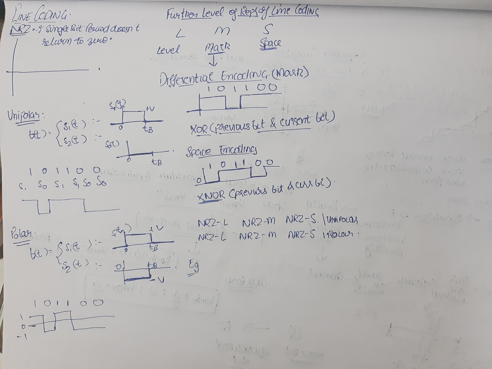
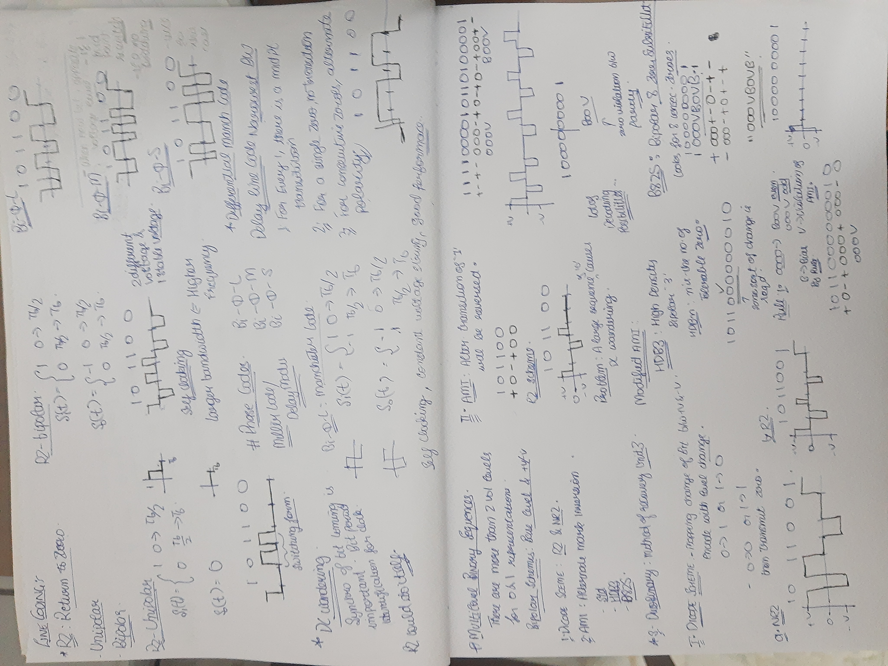

# Line Coding

Line code is a pattern of voltage, current, or photons used to represent digital data transmitted down a transmission line

- 0-1 representation denotes the performance of channel.

when 0-1 is used no AWGN in channel.

## Families of Line Coding

1. NRZ:
	1. Non Return to Zero
	2. Classification is done whether data is unipolar or polar
	3. Unipolar: bitstream is s1 and s0
2. RZ
3. Bi -$\phi$
4.

## Features of Line Coding.

## How to choose line code and spectra of line codes

Non

