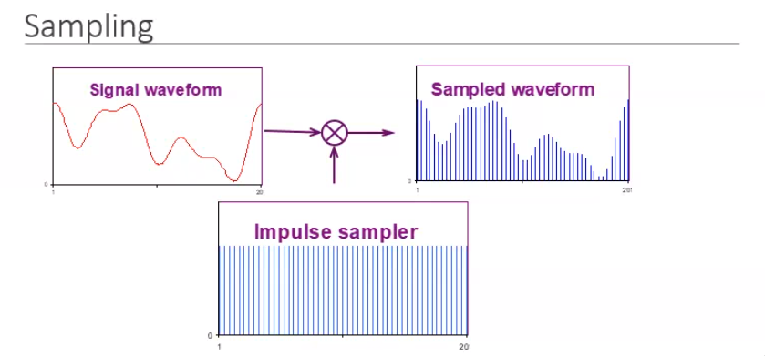
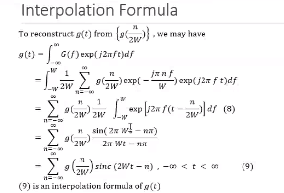

## Sampling Theorem

Sampling: take an analog waveform, multiply with impulse sampler, peridoic
impulse wave, we get a sampled waveform

Affected by number of samples we take.

### Effect of increasing the sampling time perios

How sampling changes voice quality

- Bit rate
- ASII code is 8bit
- 32kbps impies around 4000 symbols
- with reference to sampling, each symbols can be be asample
- 32kbps is 4000 samples
- 64kbps is 8000 samples
- 128 kbps is 1600 samples

## Sampling Process

Let $g_\delta(t)$ denote the ideal sampled signal

$$
g_\delta(t) = \sum_{n=-\infty}^{\infty} g(nT_s) \delta(t-nT_s)
$$

Conv is time domain and multiplication in freq domain

With
$G(f) = 0 for |f| W and f_s = 2W$

**Sinc Representation**

## Interpolation Formula

At the sample point the data is matched with a sinc wave
Sampling is summation of many sinc wave

## Anti Aliasing Filter:

- pracitcal signal are time limited hence infinite bandwitdh, and it starts to
 die out after some time, filter to get only important power rich signal

- An infinite bandwith system, is made into a band limited signal

- Low pass filter.

## Nyquist Theorem

For approiate reconstruction, the sampling Frequncy is less than the 2x of
Message Signal

**Nyquist theorem and Aliasing find it meaing**
- Aliasing:
	- Recovery signal is completely changed from the original signal

## Types of Sampling

**find the meaing of all these**

- Ideal Sampling:
	-
- Finite Sampling
- Natural Sampling:
	- 

[Wagon Wheel](https://www.youtube.com/watch?v=9MN5MF72PHs)

[Another
Example](https://www.google.com/url?sa=i&url=https%3A%2F%2Fwww.youtube.com%2Fwatch%3Fv%3DJ88lHj1aglQ&psig=AOvVaw0iJai2JinzP1MJ8AAJOeLo&ust=1595402231864000&source=images&cd=vfe&ved=0CA8Qhq8BahcKEwigzIbM5t3qAhUAAAAAHQAAAAAQFQ)
