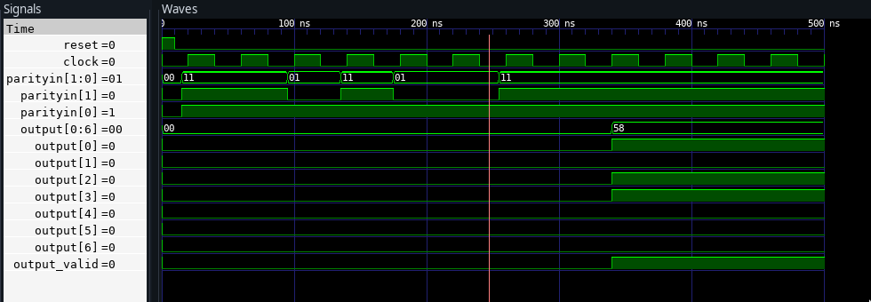

---
geometry:
    - top=1cm
    - left=1cm
    - right=1cm
    - bottom=1cm
documentclass: article
header-includes:
    - \usepackage{graphicx}
    - \usepackage{multicol}
    - \newcommand{\hideFromPandoc}[1]{#1}
    - \hideFromPandoc{
        \let\Begin\begin
        \let\End\end
      }
    - \usepackage{listings}
    - \usepackage{color}
    - \definecolor{dkgreen}{rgb}{0,0.6,0}
    - \definecolor{gray}{rgb}{0.5,0.5,0.5}
    - \definecolor{mauve}{rgb}{0.58,0,0.82}
pagestyle:
    - empty
---


\pagenumbering{gobble}


\title{Viterbi Decoder}
\author{Digital System Design, Dept of Electronics and Communications \\
Ashwin Goayl, 01711502818\\
ECE -1}

\date{\today}
\maketitle

\begin{abstract}
Communication system transmits data from source to transmitter through a channel
which may be wired or wireless. Data transmission over wireless channel is affected by
attenuation,
distortion, interference and noise, which affect the receiver’s ability to receive
correct information. Convolution  encoding  with Viterbi decoding  is  a  powerful
method  for  forward  error  correction. This FEC scheme  is an essential component
of wireless communication systems. Convolutional codes are employed to implement
FEC but the complexity of corresponding decoders elevates exponentially according
to the constraint length. The transmitted signal is corrupted mainly by “Additive
White Gaussian Noise” (AWGN).The maximum likelihood detection of a digital stream
is possible by Viterbi Algorithm.

\end{abstract}


\Begin{multicols}{2}
\section{Introduction}

The Viterbi algorithm is renowned as a maximum likelihood (ML) decoding technique for convolutional codes. The path memory unit in an (n,k,m) Viterbi Decoder is responsible for keeping track of the information bits associated with the surviving paths designated by the path metric unit. Viterbi decoders and binary convolutional codes are denoted by a three-tuple (n, k, m), where:

  - n output bits are generated whenever k input bits are received.
  - k is the number of input sequences (and hence, the encoder consists of k shift registers).
  - m designates the number of previous k-bit input blocks that must be memorized in the encoder.

Viterbi decoders are typically FPGA/ASIC based and therefore have a upper bound on the size of the path memory. A novel approach to achieving path memory savings is proposed for Viterbi Decoders. A number of traceback Viterbi decoders using this path memory were successfully developed It is shown that Viterbi decoders using this storage efficient path memory unit require a smaller chip area and achieves a faster decoding time without loss of decoding performance.

A Viterbi decoder utilizing this novel path memory achieves savings of 20% in storage for (n,1,m) codes, and <=20% for general (n,k,m) codes without loss of decoding performance. There is also a similar increase decoding performance with the novel path memory.

## Trellis Diagram

A trellis diagram is typically used to visualize how the Viterbi Algorithm make Maximum Likelihood (ML) decoding decisions. An example trellis with the final ML path is shown below

A trellis diagram is typically used to visualize how the Viterbi Algorithm make Maximum Likelihood (ML) decoding decisions. An example trellis with the final ML path is shown below

\End{multicols}

{width=55%}


\Begin{multicols}{2}

## Viterbi Algorithm

The decoding algorithm uses two metrics: the branch metric (BM) and the path metric
(PM). The branch metric is a measure of the “distance” between what was transmitted and
what was received, and is defined for each arc in the trellis. In hard decision decoding,
where we are given a sequence of digitized parity bits, the branch metric is the Hamming
distance between the expected parity bits and the received ones. For each state transition, the number on the arc
shows the branch metric for that transition. Two of the branch metrics are 0, corresponding
to the only states and transitions where the corresponding Hamming distance is 0. The
other non-zero branch metrics correspond to cases when there are bit errors.
The path metric is a value associated with a state in the trellis (i.e., a value associated
with each node). For hard decision decoding, it corresponds to the Hamming distance with
respect to the received parity bit sequence over the most likely path from the initial state to
the current state in the trellis. By “most likely”, we mean the path with smallest Hamming
distance between the initial state and the current state, measured over all possible paths
between the two states. The path with the smallest Hamming distance minimizes the total
number of bit errors, and is most likely when the BER is low.
The key insight in the Viterbi algorithm is that the receiver can compute the path metric
for a (state, time) pair incrementally using the path metrics of previously computed states
and the branch metrics

From its relatively modest, though hugely impactful, beginnings as a method to decode
convolutional codes, Viterbi decoding has become one of the most widely used algorithms
in a wide range of fields and engineering systems. Modern disk drives with “PRML”
technology to speed-up accesses, speech recognition systems, natural language systems,
and a variety of communication networks use this scheme or its variants.

\End{multicols}

{width=30%}


\Begin{multicols}{2}
\section{Viterbi Decoder Block Diagram}

Viterbi decoder are used to resolve convolution codes. This can secure the data during
transmission and also can retrieve it. Viterbi decoders also have the property of compressing
the number of bits of the data input to half. As a result redundancy in the codes is also
reduced. Hence viterbi decoding is more effective and efficient

\subsection{Branch Metric Unit}

This is first unit present in decoder. Branch Metric unit compares the received data with
the expected code and counts the number of differing bits, which is called Hamming
distance. Thus hamming distance is used for branch metric computation

\subsection{Add Compare Select}

Here in this unit two adders calculate the partial path metric of each branch an sends to
comparator, this comparator compares two path metric. Finally selector selects a particular
branch. The new partial path metric updates the state metric of state, and the survivor pathrecording block records the survivor path

\subsection{Survivor Memory Management Unit}

The Survivor Memory Management Unit (SMU) can be designed by using two methods.
One is Register Exchange method and the other is Traceback method. The Register
Exchange approach assigns a register to each state. The register records the decoded
output sequence along the path starting from the initial state to the final state, which is same
as the initial state. This method can be implemented by using Euclidean distance.
 In the TB method, the storage can be implemented as RAM and is called the path
memory. After at minimum L branches have been processed, the trellis connections are
recollected in the reverse order and the path is traced back through the trellis diagram. This
is implemented by Hamming distance.


\End{multicols}


\section{ Efficient Viterbi Decoder Architecture Traceback Procedure}


| 1.   | Initialize Data Structures                                                                                                                                                                                                                  |
| ---- | ------------------------------------------------------------------------------------------------------------------------------------------------------------------------------------------------------------------------------------------- |
| 1.1. | Initialize the trellis stage pointer to zero. Initialize the path memory write pointer to zero. Initialize the traceback pointer to zero. Initialize the decoded symbol counter to zero.                                                    |
| 1.2. | Initialize the path metric for the known initial state to zero, with the remaining 2M –1 path metrics to their maximum value. Go to step 2.                                                                                                 |


| 2.   | Compute Path  Metrics and Survivors                                                                                                                                                                                                         |
| ---- | ------------------------------------------------------------------------------------------------------------------------------------------------------------------------------------------------------------------------------------------- |
| 2.1. | Increment the trellis stage pointer, and the path memory pointer.                                                                                                                                                                           |
| 2.2. | For every trellis node, compute 2k path metrics by summing the path metrics from nodes at the previous stage to the corresponding branch metrics computed at the present stage.                                                             |
| 2.3. | Compare the 2k paths and select the path with the minimum path metric as the surviving path, all other incoming paths to the trellis node are no longer considered. If there is a tie between path metrics, the algorithm selects one path. |
| 1.1. | Store the path metric. Update the surviving path by shifting in the surviving backward label to the left hand side of the path memory register where the surviving path currently terminates.                                               |
| 2.4. | If the path memory write pointer is < T then go to step 2.1, else if the path memory write pointer = T go to step 3                                                                                                                         |

| 3.   | Traceback and Output Decision
|------|---------------------------------------------------------------------------------------------------------------------------------------------------------------------------------------------------------------------------------------------|
| 3.1.   | Set the traceback pointer equal to T. Determine the traceback start state number as the state that corresponds to the minimum path metric.                                                                                                                                                                                                                                         |
| 3.2.   | The state number and the traceback pointer are combined into a row-column address used to index path memory. Use this address to read a backward label from path memory. A predecessor state on the surviving path is then determined by use of the traceback mapping function. Decrement the traceback pointer. If the traceback pointer >1 repeat step 3.2, else go to step 3.3. |
| 3.3.   | Produce a decoded symbol.                                                                                                                                                                                                                                                                                                                                                          |
| 3.3.1. | Category 1 - A decoder decision is made for one symbol by selecting the rightmost elements  of the traceback mapping register.                                                                                                                                                                                                                                                     |
| 3.3.2. | Category 2 - A decoder decision is made for one symbol by selecting a combination of specific elements from the backward label read from path memory and the rightmost elements  of the traceback mapping register4.                                                                                                                                                               |
| 3.4.   | Increment the decoded symbol counter. If the decoded symbol count < N, go to step 2.1, else finish.                                                                                                                                                                                                                                                                                |


\pagebreak

\section{Code}


```vhdl

library ieee;
use ieee.std_logic_1164.all;
use IEEE.NUMERIC_STD.ALL;

-- (2,1,4 ViterbiDecoder)
entity ViterbiDecoder is
	Generic (
	   CONSTRAINT_LENGTH: integer := 4;
		TIME_WINDOW : integer := 7;
		TOTAL_PARITY_BITS : integer := 2;
		TOTAL_PATHS : integer := 128;
		IS_THERE_BIT_ERROR : std_logic := '0';
		BIT_ERROR_POSITION : integer := 0
    );
	Port (
		ParityIn : in std_logic_vector ( TOTAL_PARITY_BITS-1 downto 0);
		Output: out std_logic_vector(0 to TIME_WINDOW-1);
		Output_Valid : out std_logic;
		Reset : in std_logic;
		Clock : in std_logic
	);
end entity ViterbiDecoder;

architecture Behavioral of ViterbiDecoder is
	--States for the decoder
	type state is (s000, s001, s010, s011, s100, s101, s110, s111); --idle: Noninitialized
	signal starting_state : state := s000;

	type path is array (0 to TIME_WINDOW-1) of std_logic_vector(TOTAL_PARITY_BITS-1 downto 0);
	type paths is array (0 to TOTAL_PATHS-1) of path;

	type path_metrics is array (0 to TOTAL_PATHS-1) of integer;
	signal path_metric : path_metrics := (others => 0);

	signal sig_min_path_idx : integer := TOTAL_PATHS;
	signal sig_input_buffer : path := (others => "00");


	signal path_out : path := (others => "00");

```

\Begin{multicols}{2}
```verilog
	--constant path_reg : paths :=(others => (others => "11"));
	constant path_reg : paths :=

			(("00","00","00","00","00","00","00"),
			("00","00","00","00","00","00","11"),
			("00","00","00","00","00","11","11"),
			("00","00","00","00","00","11","00"),
			("00","00","00","00","11","11","10"),
			("00","00","00","00","11","11","01"),
			("00","00","00","00","11","00","01"),
			("00","00","00","00","11","00","10"),
			("00","00","00","11","11","10","11"),
			("00","00","00","11","11","10","00"),
			("00","00","00","11","11","01","00"),
			("00","00","00","11","11","01","11"),
			("00","00","00","11","00","01","01"),
			("00","00","00","11","00","01","10"),
			("00","00","00","11","00","10","10"),
			("00","00","00","11","00","10","01"),
			("00","00","11","11","10","11","00"),
			("00","00","11","11","10","11","11"),
			("00","00","11","11","10","00","11"),
			("00","00","11","11","10","00","00"),
			("00","00","11","11","01","00","10"),
			("00","00","11","11","01","00","01"),
			("00","00","11","11","01","11","01"),
			("00","00","11","11","01","11","10"),
			("00","00","11","00","01","01","11"),
			("00","00","11","00","01","01","00"),
			("00","00","11","00","01","10","00"),
			("00","00","11","00","01","10","11"),
			("00","00","11","00","10","10","01"),
			("00","00","11","00","10","10","10"),
			("00","00","11","00","10","01","10"),
			("00","00","11","00","10","01","01"),
			("00","11","11","10","11","00","00"),
			("00","11","11","10","11","00","11"),
			("00","11","11","10","11","11","11"),
			("00","11","11","10","11","11","00"),
			("00","11","11","10","00","11","10"),
			("00","11","11","10","00","11","01"),
			("00","11","11","10","00","00","01"),
			("00","11","11","10","00","00","10"),
			("00","11","11","01","00","10","11"),
			("00","11","11","01","00","10","00"),
			("00","11","11","01","00","01","00"),
			("00","11","11","01","00","01","11"),
			("00","11","11","01","11","01","01"),
			("00","11","11","01","11","01","10"),
			("00","11","11","01","11","10","10"),
			("00","11","11","01","11","10","01"),
			("00","11","00","01","01","11","00"),
			("00","11","00","01","01","11","11"),
			("00","11","00","01","01","00","11"),
			("00","11","00","01","01","00","00"),
			("00","11","00","01","10","00","10"),
			("00","11","00","01","10","00","01"),
			("00","11","00","01","10","11","01"),
			("00","11","00","01","10","11","10"),
			("00","11","00","10","10","01","11"),
			("00","11","00","10","10","01","00"),
			("00","11","00","10","10","10","00"),
			("00","11","00","10","10","10","11"),
			("00","11","00","10","01","10","01"),
			("00","11","00","10","01","10","10"),
			("00","11","00","10","01","01","10"),
			("00","11","00","10","01","01","01"),
			("11","11","10","11","00","00","00"),
			("11","11","10","11","00","00","11"),
			("11","11","10","11","00","11","11"),
			("11","11","10","11","00","11","00"),
			("11","11","10","11","11","11","10"),
			("11","11","10","11","11","11","01"),
			("11","11","10","11","11","00","01"),
			("11","11","10","11","11","00","10"),
			("11","11","10","00","11","10","11"),
			("11","11","10","00","11","10","00"),
			("11","11","10","00","11","01","00"),
			("11","11","10","00","11","01","11"),
			("11","11","10","00","00","01","01"),
			("11","11","10","00","00","01","10"),
			("11","11","10","00","00","10","10"),
			("11","11","10","00","00","10","01"),
			("11","11","01","00","10","11","00"),
			("11","11","01","00","10","11","11"),
			("11","11","01","00","10","00","11"),
			("11","11","01","00","10","00","00"),
			("11","11","01","00","01","00","10"),
			("11","11","01","00","01","00","01"),
			("11","11","01","00","01","11","01"),
			("11","11","01","00","01","11","10"),
			("11","11","01","11","01","01","11"),
			("11","11","01","11","01","01","00"),
			("11","11","01","11","01","10","00"),
			("11","11","01","11","01","10","11"),
			("11","11","01","11","10","10","01"),
			("11","11","01","11","10","10","10"),
			("11","11","01","11","10","01","10"),
			("11","11","01","11","10","01","01"),
			("11","00","01","01","11","00","00"),
			("11","00","01","01","11","00","11"),
			("11","00","01","01","11","11","11"),
			("11","00","01","01","11","11","00"),
			("11","00","01","01","00","11","10"),
			("11","00","01","01","00","11","01"),
			("11","00","01","01","00","00","01"),
			("11","00","01","01","00","00","10"),
			("11","00","01","10","00","10","11"),
			("11","00","01","10","00","10","00"),
			("11","00","01","10","00","01","00"),
			("11","00","01","10","00","01","11"),
			("11","00","01","10","11","01","01"),
			("11","00","01","10","11","01","10"),
			("11","00","01","10","11","10","10"),
			("11","00","01","10","11","10","01"),
			("11","00","10","10","01","11","00"),
			("11","00","10","10","01","11","11"),
			("11","00","10","10","01","00","11"),
			("11","00","10","10","01","00","00"),
			("11","00","10","10","10","00","10"),
			("11","00","10","10","10","00","01"),
			("11","00","10","10","10","11","01"),
			("11","00","10","10","10","11","10"),
			("11","00","10","01","10","01","11"),
			("11","00","10","01","10","01","00"),
			("11","00","10","01","10","10","00"),
			("11","00","10","01","10","10","11"),
			("11","00","10","01","01","10","01"),
			("11","00","10","01","01","10","10"),
			("11","00","10","01","01","01","10"),
			("11","00","10","01","01","01","01"));

```
\End{multicols}

```verilog


	function FuncHammingDistance (
				x : std_logic_vector(TOTAL_PARITY_BITS-1 downto 0);
				y : std_logic_vector(TOTAL_PARITY_BITS-1 downto 0))
				return integer is
		variable d : integer := 0;
	begin
		for i in x'range loop
			if ( x(i) /= y(i) )then
				d := d + 1;
			end if;
		end loop;
		return d;
	end FuncHammingDistance;


	function FuncSelectMinPathIndex (path_metric : path_metrics) return integer is
		variable min_idx : integer := 0;
		variable min_pm : integer := path_metric(0); -- Assign a value to avoid garbage
	begin
		for j in 0 to TOTAL_PATHS-1 loop
			if (path_metric(j) < min_pm)then
				min_pm := path_metric(j);
				min_idx := j;
			end if;
		end loop;
		return min_idx;
	end FuncSelectMinPathIndex;

	function FuncCalculatePathMetric (
				path_index : integer;
				input_buffer : path)
				return integer is
		variable output : integer := 0;
	begin
		for x in 0 to TIME_WINDOW-1 loop
			output := output + FuncHammingDistance(path_reg(path_index)(x), input_buffer(x));
		end loop;
		return output;
	end FuncCalculatePathMetric;

```

\Begin{multicols}{2}


```verilog

	function FuncGetOutputBitFromPath (
		current_state : state;
		codeword : std_logic_vector
			(TOTAL_PARITY_BITS-1 downto 0) )
		return std_logic is
	begin
		case current_state is
			when s000 =>
				if (codeword = "00") then
					return '0';
				else
					return '1';
				end if;
			when s001 =>
				if (codeword = "11")then
					return '0';
				else
					return '1';
				end if;
			when s010 =>
				if (codeword = "10")then
					return '0';
				else
					return '1';
				end if;
			when s011 =>
				if (codeword = "01")then
					return '0';
				else
					return '1';
				end if;
			when s100 =>
				if (codeword = "11")then
					return '0';
				else
					return '1';
				end if;
			when s101 =>
				if(codeword = "00")then
					return '0';
				else
					return '1';
				end if;
			when s110 =>
				if(codeword = "01")then
					return '0';
				else
					return '1';
				end if;
			when s111 =>
				if (codeword = "10")then
					return '0';
				else
					return '1';
				end if;
			when others => null;
		end case;
	end FuncGetOutputBitFromPath;


	function FuncGetNextStateFromPath (
		current_state : state;
		codeword : std_logic_vector
			(TOTAL_PARITY_BITS-1 downto 0) )
		return state is
	begin
		case current_state is
			when s000 =>
				if (codeword = "00") then
					return s000;
				else
					return s100;
				end if;
			when s001 =>
				if (codeword = "11")then
					return s000;
				else
					return s100;
				end if;
			when s010 =>
				if (codeword = "10")then
					return s001;
				else
					return s101;
				end if;
			when s011 =>
				if (codeword = "01")then
					return s001;
				else
					return s101;
				end if;
			when s100 =>
				if (codeword = "11")then
					return s010;
				else
					return s110;
				end if;
			when s101 =>
				if(codeword = "00")then
					return s010;
				else
					return s110;
				end if;
			when s110 =>
				if(codeword = "01")then
					return s011;
				else
					return s111;
				end if;
			when s111 =>
				if (codeword = "10")then
					return s011;
				else
					return s111;
				end if;
			when others => null;
		end case;
	end FuncGetNextStateFromPath;

```

\End{multicols}

```verilog

	function FuncGenerateOutputFromPath (pathx : path) return std_logic_vector is
		variable next_state : state := s000;
		variable  out_buf : std_logic_vector(0 to TIME_WINDOW-1);
	begin
		for n in 0 to TIME_WINDOW-1 loop
			out_buf(n) := FuncGetOutputBitFromPath(next_state, pathx(n));

			next_state := FuncGetNextStateFromPath(next_state, pathx(n));
		end loop;
		return out_buf;
	end FuncGenerateOutputFromPath;

begin

	process	(Clock, Reset, ParityIn) is
		variable t: integer := 0;
		variable path_index: integer := 0;
		variable pm_calc_done: std_logic := '0'; --PM Calculation done signal
		variable input_buffer : path := (others => "00");
		variable min_path_idx : integer := TOTAL_PATHS;
		variable decoder_out : std_logic_vector(0 to TIME_WINDOW-1) := (others => '0');
		variable min_select_done : std_logic := '0';
		variable Output_valid_flag : std_logic := '0';
		variable first_time_execution : std_logic := '1';
	begin
		if	( Reset = '1' ) then --Asynchronous Reset
			t := 0;
			path_metric <= (others => 0);
			input_buffer := (others => "00");
			Output_valid_flag := '0';
			path_out <= (others => "00");
			pm_calc_done := '0';
		else
			if	(Clock'EVENT and Clock = '1') then --Rising edge
				if (t = TIME_WINDOW) then
							--Calculate path metric, select path, output
					sig_input_buffer <= input_buffer; --Just for seeing in simulation
					if(IS_THERE_BIT_ERROR = '1' and first_time_execution='1')then
						input_buffer(BIT_ERROR_POSITION) := input_buffer(BIT_ERROR_POSITION)(1)
										& (not input_buffer(BIT_ERROR_POSITION)(0));
						first_time_execution := '0';
						sig_input_buffer <= input_buffer;
					end if;
					for path_index in 0 to TOTAL_PATHS-1 loop
							--Calculate path metric for every possible path
						path_metric(path_index) <= FuncCalculatePathMetric(path_index, input_buffer);
						if(path_index = TOTAL_PATHS-1) then
							pm_calc_done := '1';
						end if;
					end loop;
					if(pm_calc_done = '1') then
						min_path_idx := FuncSelectMinPathIndex(path_metric);
									-- If the PM calculation is done, select the min path index
						sig_min_path_idx <= min_path_idx;
						pm_calc_done := '0';
						min_select_done := '1';
					end if;
					if(min_select_done = '1')then
						decoder_out := FuncGenerateOutputFromPath(path_reg(min_path_idx));
								-- Generate output bits from resulting path using truth table of encoder.
						min_select_done := '0';
						if (decoder_out /= "0000000")then
							Output_valid_flag := '1';
						end if;
					end if;
				else
					input_buffer(t) :=  ParityIn; --Add the input to input_buffer
					t := t + 1; -- Increase the time variable by 1
				end if;
			end if;
		end if;
		Output_Valid <= Output_valid_flag;
		Output <= decoder_out;
	end process;
end architecture;
```


\pagebreak


\section{Testbench}


```vhdl


library ieee;
use ieee.std_logic_1164.all;

entity viterbi_decoder_tb is
end entity viterbi_decoder_tb;

architecture stimulus_driver of viterbi_decoder_tb is
	constant CLK_PERIOD : time := 40 ns;
	constant TIME_MARGIN : time := 10 ns;
	component ViterbiDecoder is
		Generic (
			CONSTRAINT_LENGTH: integer := 4;
			TIME_WINDOW : integer := 7;
			TOTAL_PARITY_BITS : integer := 2;
			TOTAL_PATHS : integer := 128
		 );
		Port (
			ParityIn : in std_logic_vector (1 downto 0);
			Output: out std_logic_vector(6 downto 0);
			Output_Valid : out std_logic;
			Reset : in std_logic;
			Clock : in std_logic
		);
	end component ViterbiDecoder;
	signal s_parityin : std_logic_vector (1 downto 0) := "00";
	signal s_output : std_logic_vector(6 downto 0);
	signal s_output_valid : std_logic := '0';
	signal s_reset, s_clock : std_logic := '0';
begin
	UnitUnderTest7 : ViterbiDecoder port map (
		ParityIn => s_parityin,
		Output => s_output,
		Output_Valid => s_output_valid,
		Reset => s_reset,
		Clock => s_clock
	);

	s_clock <= not s_clock after CLK_PERIOD/2;


	Stimulus: process is begin
		--Initialization
		s_parityin <= "00";
		s_reset <= '1';

		--Waiting
		wait for 10 ns; --Time margin to avoid inputs changing at clock cycle.

		--Write possible inputs
		s_reset <= '0';

		wait for 5 ns;

		s_parityin <= "11"; --Expected decoder out: 1011000
		wait for CLK_PERIOD;

		s_parityin <= "11";
		wait for CLK_PERIOD;

		s_parityin <= "01";
		wait for CLK_PERIOD;

		s_parityin <= "11";
		wait for CLK_PERIOD;

		s_parityin <= "01";
		wait for CLK_PERIOD;

		s_parityin <= "01";
		wait for CLK_PERIOD;

		s_parityin <= "11";
		wait for CLK_PERIOD;


		wait for 5*CLK_PERIOD;

		if(s_output_valid ='1')then
			assert s_output = "1011000" report "Expected result does not match the output!" severity WARNING;
		end if;
		--Stop simulation
		wait;
	end ;
end ;

```

\section{Simulation Waveform}





### References
1. Wang, X., Zhang, Y., & Chen, H. (2012, March 16). Design of Viterbi Decoder Based on FPGA. Retrieved from https://www.sciencedirect.com/science/article/pii/S1875389212002295

2. LogiCORE IP Veterbii Decoder Datasheet. (n.d.). Retrieved from

 	https://www.xilinx.com/support/documentation/ip_documentation/viterbi_ds247.pdf.


3. Viterbi Decoding of Convolutional Codes [Video file]. (n.d.). Retrieved from

	https://ocw.mit.edu/courses/electrical-engineering-and-computer-science/6-02-introduction-to-eecs-ii-digital-communication-systems-fall-2012/readings/MIT6_02F12_chap08.pdf.
