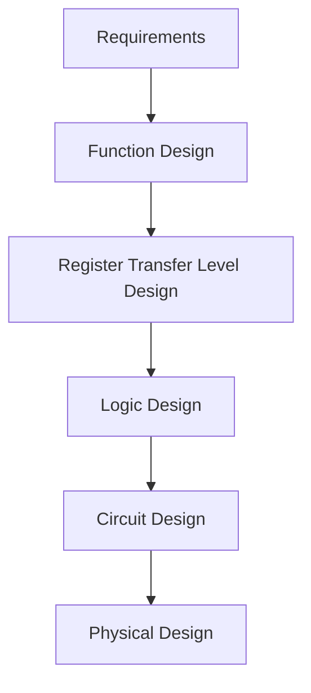
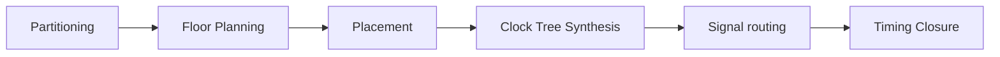
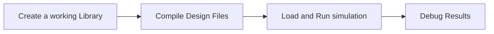
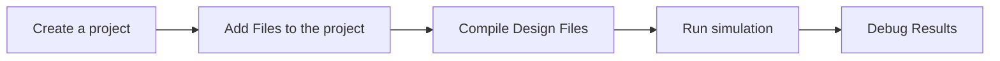

## **Aim:**

Introduction to VHDL and MODELSIM simulator

## **Software used:**

MODELSIM

## **Theory :**

**VHDL**: Very high speed intergrated circuit Hardware Description Language.

It is a hardware description language that can be used to model a
digital system at many levels of abstraction ranging from algorithmic
level to the gate level. The complexity of the digital system being
modeled coudl vary from that of a simple gate to a complete digital
electronic systems, or anything in between. The Digtal Systems can be
also be descirbed hierachically. Timing can also be explicitly modeled
of the Following languages: - sequential language - concurrent language - net-list language - timeing speciifications - waverform genereation language

HDL have a specific purpose, rather that being used to design software, an HDL
is used to define a computer chip. VHDL can be used to describe any type of
circuitry and is frequently used in the design, simulation, and testing of
processors, CPUs, motherboards, FPGAs, ASICs, and many other types of types of
digital circuitry.

**ModelSim**: ModelSim is a multi-language HDL simulation environment by Mentor Graphics, for simulation of hardware description languages such as VHDL, Verilog and SystemC, and includes a built-in C debugger. ModelSim can be used independently, or in conjunction with Intel Quartus Prime, Xilinx ISE or Xilinx Vivado. Simulation is performed using the graphical user interface (GUI), or automatically using scripts

- Unified mixed language simulation engine for ease of use and performance
- Native support of Verilog, SystemVerilog for design, VHDL, and SystemC for effective verification of sophisticated design environments
- Fast time-to-debug, easy to use, multi-language debug environment
- Advanced code coverage and analysis tools for fast time to coverage closure

- Interactive and Post-Sim Debug available so same debug environment used for both
- Powerful Waveform compare for easy analysis of differences and bugs
- Unified Coverage Database with complete interactive and HTML reporting and processing for understanding and debugging coverage throughout your project

**Design Flow:**

- Requirements
- Function Design: - Behavioral Simulation
- Register Transfer Level Design: - RTL Simulation validation
- Logic Design: - Logic simulation - Verifaction - Fault Simulation
- Circuit Design: - Timing simulation - Circuit Analysis
- Physical Design : - Design Rule Checking - MUXes, Flip-flops, Circuit level Desinging - Copper cloded path - CAD tools are used

**Physical Design Flow**

## **Block Diagram showing ModelSim Software:**

#### Basic Simulation Flow

#### Project Flow

## **Steps for using Software:**

**Example of VHDL Code:**

and or not
nand nor
[xor](xor) xnor

**Result:**
