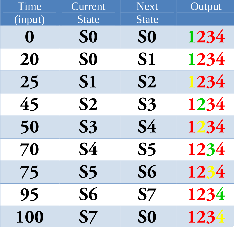
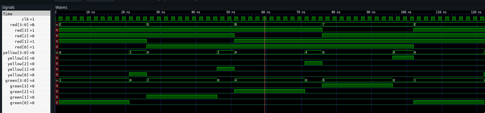

---
geometry:
  - top=1cm
  - left=3cm
  - right=3cm
  - bottom=1cm
---

# State Table



The color in output represents output light.

time =  0 after time becomes 100.

\pagebreak

# Codes

## 4 way traffic light controller


```vhdl
library IEEE;
use IEEE.STD_LOGIC_1164.all;
entity traffic is
	port(
		clk : in STD_LOGIC;
	        green: out std_logic_vector(3 downto 0);
		yellow: out std_logic_vector(3 downto 0);
		red: out std_logic_vector(3 downto 0)
	     );
end entity traffic;
architecture trafficA of traffic is
type state_type is (s0, s1, s2, s3, s4, s5,s6,s7); -- defined state for each combination possible
signal state : state_type := s0; -- initial state is s0
signal count : integer := 0; -- represents time
		signal lights: std_logic_vector(11 downto 0); -- a vector that represents a state
begin
	STATEpro : process(state)
		begin
			case state is
				when s0 => lights <= "001100100100";
				when s1 => lights <= "010100100100";
				when s2 => lights <= "100001100100";
				when s3 => lights <= "100010100100";
				when s4 => lights <= "100100001100";
				when s5 => lights <= "100100010100";
				when s6 => lights <= "100100100001";
				when s7 => lights <= "100100100010";
				when others => lights <= lights;
			end case;
		end process;
	LT : process(clk)
	     begin
		case count is
			when 0 => state <= s0; count <= count + 1;
			when 20 => state <= s1; count <= count + 1; -- 1st green ends
			when 25 => state <= s2; count <= count + 1; -- 1st yellow ends
			when 45 => state <= s3; count <= count + 1; -- 2nd green ends
			when 50 => state <= s4; count <= count + 1; -- 2nd yellow ends
			when 70 => state <= s5; count <= count + 1; -- 3rd green ends
			when 75 => state <= s6; count <= count + 1; -- 3rd yellow ends
			when 95 => state <= s7; count <= count + 1; -- 4th green ends
			when 100 => count <= 0;-- 4th yellow ends
			when others => count <= count + 1;
		end case;
		green(3) <= lights(0);
		yellow(3) <= lights(1);
		red(3) <= lights(2);
		green(2) <= lights(3);
		yellow(2) <= lights(4);
		red(2) <= lights(5);
		green(1) <= lights(6);
		yellow(1) <= lights(7);
		red(1) <= lights(8);
		green(0) <= lights(9);
		yellow(0) <= lights(10);
		red(0) <= lights(11);
	     end process;
end architecture trafficA;
```

## Testbench

```vhdl
-- Uncomment the following library declaration if using
-- arithmetic functions with Signed or Unsigned values
--USE ieee.numeric_std.ALL;

library IEEE;
use IEEE.STD_LOGIC_1164.all;

ENTITY controller_tb IS
END controller_tb;

ARCHITECTURE behavior OF controller_tb IS

    -- Component Declaration for the Unit Under Test (UUT)

    COMPONENT traffic
    PORT(
         clk : IN  std_logic;
         green : OUT  std_logic_vector(3 downto 0);
         yellow : OUT  std_logic_vector(3 downto 0);
         red : OUT  std_logic_vector(3 downto 0)
        );
    END COMPONENT;


   --Inputs
   signal clk : std_logic := '0';

   signal green : std_logic_vector(3 downto 0);
   signal yellow : std_logic_vector(3 downto 0);
   signal red : std_logic_vector(3 downto 0);

   constant clk_period : time := 2 ns;

BEGIN

   uut: traffic PORT MAP (
          clk => clk,
          green => green,
          yellow => yellow,
          red => red
        );

   clk_process :process
   begin
		clk <= '0';
		wait for clk_period/2;
		clk <= '1';
		wait for clk_period/2;
   end process;
END;

```

\pagebreak

## Output





## Result

A traffic light controller was desgined and implemented via VHDL. Output was
thus obtained.
