## Aim:

1. Half Adder and Full Adder (using basic gates and universal gates).
2. Half subtractor and Full Subtractor (using basic gate and universal
   gates).

Using DataFlow style of Modelling

File: Aim, Software Used, Theory, Circuit Diagram , Boolean Expression, VHDL
Codes, Waveform, Result.

\pagebreak

## Circuit Diagram

## Half Adder using Basic Gates

@import "/projects/experiment2/half_adder/basic_gates/basic_gates.png"

## Half Adder using Universal Gates

### 1. NAND GATE

@import "/projects/experiment2/half_adder/nand_gate/nand_gate.png"

### 2. NOR GATE

@import "/projects/experiment2/half_adder/nor_gate/nor_gate.png"

\pagebreak

## Half Subtractor using Basic Gates

@import "/projects/experiment2/half_sub/basic_gates/basic_gate.png"

## Half Subtractor using Universal Gates

### 1. NAND GATE

@import "/projects/experiment2/half_sub/nand_gate/nand_gate.png"

### 2. NOR GATE

@import "/projects/experiment2/half_sub/nor_gate/nor_gate.png"

\pagebreak

## Full Adder using Basic Gates

@import "/projects/experiment2/full_adder/basic_gates/basic_gate.png"

## Full Adder using Universal Gates

### 1. NAND GATE

@import "/projects/experiment2/full_adder/nand_gate/nand_gate.png"

### 2. NOR GATE

@import "/projects/experiment2/full_adder/nor_gate/nor_gate.png"

\pagebreak

## Full Subtractor using Basic Gates

@import "/projects/experiment2/full_sub/basic_gates/basic_gate.png"

## Full Subtractor using Universal Gates

### 1. NAND GATE

@import "/projects/experiment2/full_sub/nand_gate/nand_gate.png"

### 2. NOR GATE

@import "/projects/experiment2/full_sub/nor_gate/nor_gate.png"

\pagebreak

## VHDL CODE:

## Half Adder using Basic Gates

```vhdl
library ieee;
use ieee.std_logic_1164.all;

entity half_adder is
    port (
        a  : in  std_logic;
        b  : in  std_logic;
        s  : out std_logic;
        co : out std_logic);
end;

architecture HALF_ADDER of half_adder is
begin
	s <= ((not a) and b) or (a and (not b));
	co <= a and b;
end;


```

## Half Adder using Universal Gates

### 1. NAND GATE

```vhdl
library ieee;
use ieee.std_logic_1164.all;

entity half_adder is
    port (
        a  : in  std_logic;
        b  : in  std_logic;
        s  : out std_logic;
        co : out std_logic);
end;

architecture behavioral of half_adder is
	 signal w_WIRE_1 : std_logic;
	 signal w_WIRE_2 : std_logic;
	 signal w_WIRE_3 : std_logic;
begin
	w_WIRE_1 <= a nand b;
	w_WIRE_2 <= w_WIRE_1 nand a;
	w_WIRE_3 <= w_WIRE_1 nand b;

	s <= w_WIRE_2 nand w_WIRE_3;
	co <= w_WIRE_1 nand w_WIRE_1;
end;


```

\pagebreak

### 2. NOR GATE

```vhdl
library ieee;
use ieee.std_logic_1164.all;

entity half_adder is
    port (
        a  : in  std_logic;
        b  : in  std_logic;
        s  : out std_logic;
        co : out std_logic);
end;

architecture HALF_ADDER of half_adder is
	 signal w_WIRE_1 : std_logic;
	 signal w_WIRE_2 : std_logic;
	 signal w_WIRE_3 : std_logic;
begin
	w_WIRE_1 <= a nor b;
	w_WIRE_2 <= a nor a;
	w_WIRE_3 <= b nor b;

	co <= w_WIRE_2 nor w_WIRE_3;
	s <= w_WIRE_1 nor (w_WIRE_2 nor w_WIRE_3);
end;


```

### HALF ADDER WAVEFORMS

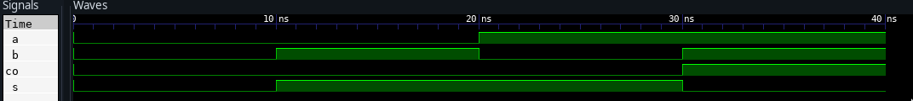

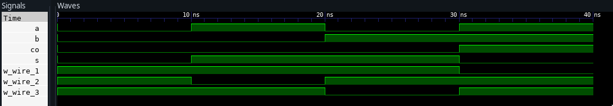

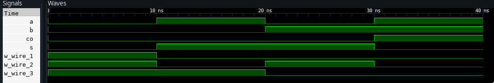

## Half subtractor using Basic Gates

```vhdl
library ieee;
use ieee.std_logic_1164.all;

entity half_subtractor is
    port (
        a  : in  std_logic;
        b  : in  std_logic;
        d  : out std_logic;
        bo : out std_logic);
end;

architecture HALF_SUB of half_subtractor is
begin
	d <= ((not a) and b) or (a and (not b));
	bo <= (not a) and b;
end;


```

## Half subtractor using Universal Gates

### 1. NAND GATE

```vhdl
library ieee;
use ieee.std_logic_1164.all;

entity half_subtractor is
    port (
        a  : in  std_logic;
        b  : in  std_logic;
        d  : out std_logic;
        bo : out std_logic);
end;

architecture HALF_SUB of half_subtractor is
	 signal w_WIRE_1 : std_logic;
	 signal w_WIRE_2 : std_logic;
	 signal w_WIRE_3 : std_logic;
begin
	w_WIRE_1 <= a nand b;
	w_WIRE_2 <= w_WIRE_1 nand a;
	w_WIRE_3 <= w_WIRE_1 nand b;

	d <= w_WIRE_2 nand w_WIRE_3;
	bo <= w_WIRE_3 nand w_WIRE_3;
end;


```

\pagebreak

### 2. NOR GATE

```vhdl
library ieee;
use ieee.std_logic_1164.all;
entity half_subtractor is
    port (
        a  : in  std_logic;
        b  : in  std_logic;
        d  : out std_logic;
        bo : out std_logic);
end;
architecture HALF_SUB of half_subtractor is
	 signal w_WIRE_1 : std_logic;
	 signal w_WIRE_2 : std_logic;
	 signal w_WIRE_3 : std_logic;
begin
	w_WIRE_1 <= a nor b;
	w_WIRE_2 <= a nor w_WIRE_1;
	w_WIRE_3 <= b nor w_WIRE_1;
	d <= (w_WIRE_2 nor w_WIRE_3) nor (w_WIRE_2 and w_WIRE_3) ;
	bo <= w_WIRE_2;
end;


```

### HALF SUBTRACTOR WAVEFORMS

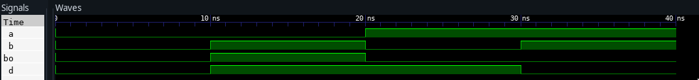

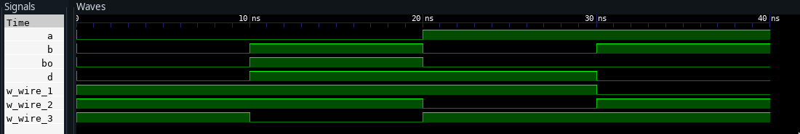

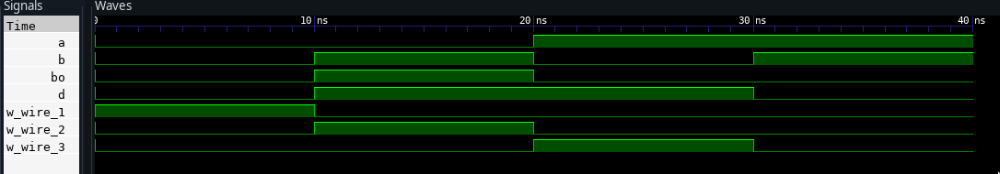

\pagebreak

## Full Adder using Basic Gates

```vhdl
library ieee;
use ieee.std_logic_1164.all;
entity full_adder is
    port (
        a  : in  std_logic;
        b  : in  std_logic;
        ci : in  std_logic;
        s  : out std_logic;
        co : out std_logic);
end;
architecture ADDER of full_adder is
begin
    s <= ((not a) and (not b) and ci) or (a and (not b) and (not ci)) or ((not
	 a) and b and (not ci)) or (a and b and ci);
    co <= (a and b) or (b and ci) or (a and ci) ;
end;
```

## Full Adder using Universal Gates

### 1. NAND GATE

```vhdl
library ieee;
use ieee.std_logic_1164.all;
entity full_adder is
    port (
        a  : in  std_logic;
        b  : in  std_logic;
        ci : in  std_logic;
        s  : out std_logic;
        co : out std_logic);
end;
architecture ADDER of full_adder is
	 signal w_WIRE_1 : std_logic;
	 signal w_WIRE_2 : std_logic;
	 signal w_WIRE_3 : std_logic;
	 signal w_WIRE_4 : std_logic;
	 signal w_WIRE_5 : std_logic;
	 signal w_WIRE_6 : std_logic;
	 signal w_WIRE_7 : std_logic;
begin
	w_WIRE_1 <= a nand b;
	w_WIRE_2 <= w_WIRE_1 nand a;
	w_WIRE_3 <= w_WIRE_1 nand b;
	w_WIRE_4 <= w_WIRE_2 nand w_WIRE_3;
	w_WIRE_5 <= w_WIRE_4 nand ci;
	w_WIRE_6 <= w_WIRE_5 nand w_WIRE_4;
	w_WIRE_7 <= w_WIRE_5 nand ci;

	s <= w_WIRE_6 nand w_WIRE_7;
	co <= w_WIRE_1 nand w_WIRE_5;
end;

```

### 2. NOR GATE

```vhdl
library ieee;
use ieee.std_logic_1164.all;

entity full_adder is
    port (
        a  : in  std_logic;
        b  : in  std_logic;
        ci : in  std_logic;
        s  : out std_logic;
        co : out std_logic);
end;

architecture ADDER of full_adder is
	 signal w_WIRE_1 : std_logic;
	 signal w_WIRE_2 : std_logic;
	 signal w_WIRE_3 : std_logic;
	 signal w_WIRE_4 : std_logic;
	 signal w_WIRE_5 : std_logic;
	 signal w_WIRE_6 : std_logic;
	 signal w_WIRE_7 : std_logic;
	 signal w_WIRE_8 : std_logic;
	 signal w_WIRE_9 : std_logic;
	 signal w_WIRE_10: std_logic;
begin
	w_WIRE_1 <= a nor b;
	w_WIRE_2 <= a nor a;
	w_WIRE_3 <= b nor b;
	w_WIRE_4 <= w_WIRE_2 nor w_WIRE_3;
	w_WIRE_5 <= w_WIRE_4 nor w_WIRE_1;
	w_WIRE_6 <= w_WIRE_5 nor ci;
	w_WIRE_7 <= w_WIRE_5 nor w_WIRE_5;
	w_WIRE_8 <= ci nor ci;
	w_WIRE_9 <= w_WIRE_8 nor w_WIRE_7;
	w_WIRE_10<= w_WIRE_4 nor w_WIRE_9;

	s <= w_WIRE_9 nor w_WIRE_6;
	co <= w_WIRE_10 nor w_WIRE_10;
end;

```

\pagebreak

### FULL ADDER WAVEFORMS

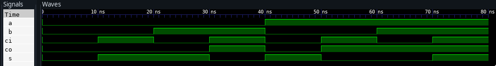

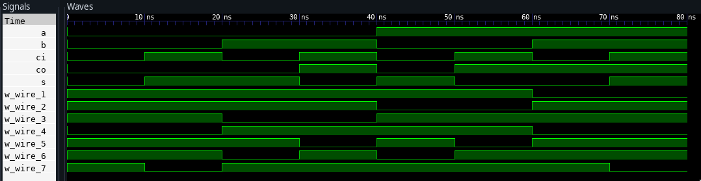

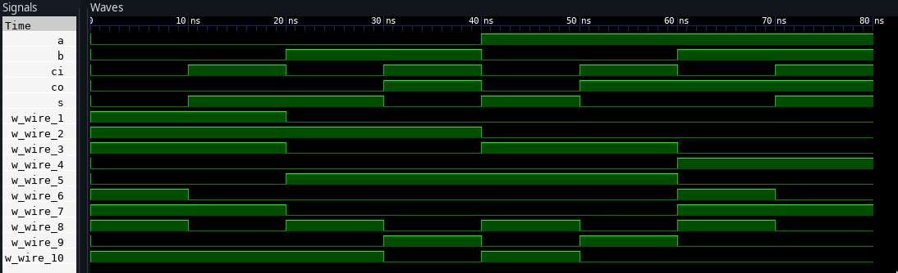

\pagebreak

## Full subtractor using Basic Gates

```vhdl
library ieee;
use ieee.std_logic_1164.all;
entity full_subtractor is
    port (
        a  : in  std_logic;
        b  : in  std_logic;
        bi : in  std_logic;
        d  : out std_logic;
        bo : out std_logic);
end;
architecture SUB of full_subtractor is
begin
    d <= ((not a) and (not b) and bi) or (a and (not b) and (not bi)) or ((not
	 a) and b and (not bi)) or (a and b and bi);
    bo <= (b and bi) or ((not a) and b) or ((not a) and bi);
end;

```

## Full subtractor using Universal Gates

### 1. NAND GATE

```vhdl
library ieee;
use ieee.std_logic_1164.all;
entity full_subtractor is
    port (
        a  : in  std_logic;
        b  : in  std_logic;
        bi : in  std_logic;
        d  : out std_logic;
        bo : out std_logic);
end;
architecture SUB of full_subtractor is
	 signal w_WIRE_1 : std_logic;
	 signal w_WIRE_2 : std_logic;
	 signal w_WIRE_3 : std_logic;
	 signal w_WIRE_4 : std_logic;
	 signal w_WIRE_5 : std_logic;
	 signal w_WIRE_6 : std_logic;
	 signal w_WIRE_7 : std_logic;
begin
	w_WIRE_1 <= a nand b;
	w_WIRE_2 <= w_WIRE_1 nand a;
	w_WIRE_3 <= w_WIRE_1 nand b;
	w_WIRE_4 <= w_WIRE_2 nand w_WIRE_3;
	w_WIRE_5 <= w_WIRE_4 nand bi;
	w_WIRE_6 <= w_WIRE_5 nand w_WIRE_4;
	w_WIRE_7 <= w_WIRE_5 nand bi;

	d <= w_WIRE_6 nand w_WIRE_7;
	bo <= w_WIRE_3 nand w_WIRE_7;
end;

```

### 2. NOR GATE

```vhdl
library ieee;
use ieee.std_logic_1164.all;

entity full_subtractor is
    port (
        a  : in  std_logic;
        b  : in  std_logic;
        bi : in  std_logic;
        d  : out std_logic;
        bo : out std_logic);
end;

architecture SUB of full_subtractor is
	 signal w_WIRE_1 : std_logic;
	 signal w_WIRE_2 : std_logic;
	 signal w_WIRE_3 : std_logic;
	 signal w_WIRE_4 : std_logic;
	 signal w_WIRE_5 : std_logic;
	 signal w_WIRE_6 : std_logic;
	 signal w_WIRE_7 : std_logic;
	 signal w_WIRE_8 : std_logic;
	 signal w_WIRE_9 : std_logic;

begin
	w_WIRE_1 <= a nor b;
	w_WIRE_2 <= w_WIRE_1 nor a;
	w_WIRE_3 <= w_WIRE_1 nor b;
	w_WIRE_4 <= w_WIRE_2 nor w_WIRE_3;
	w_WIRE_5 <= w_WIRE_4 nor w_WIRE_4;
	w_WIRE_6 <= w_WIRE_5 nor bi;
	w_WIRE_7 <= w_WIRE_5 nor w_WIRE_6;
	w_WIRE_8 <= w_WIRE_6 nor bi;
	w_WIRE_9 <= w_WIRE_8 nor w_WIRE_7;


	d <= w_WIRE_9 nor w_WIRE_9;
	bo <= (w_WIRE_2 nor w_WIRE_7) nor (w_WIRE_2 nor w_WIRE_7);
end;

```

\pagebreak

### FULL SUBTRACTOR WAVEFORMS

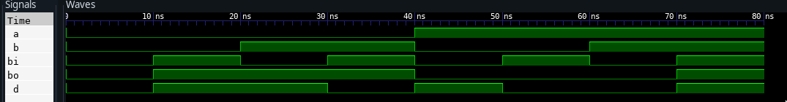

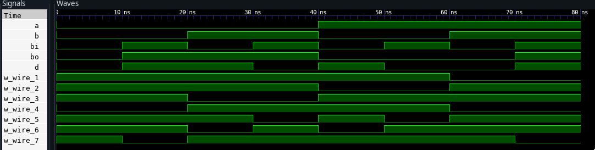

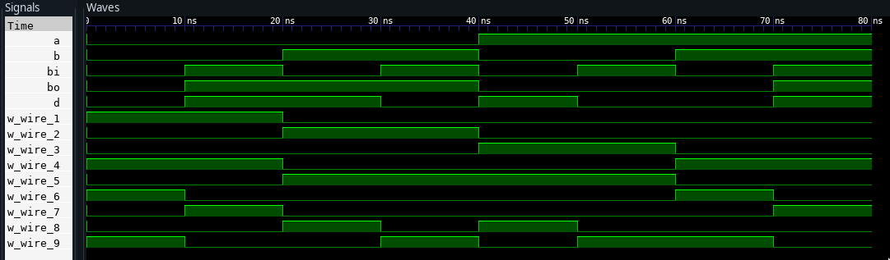

\pagebreak
