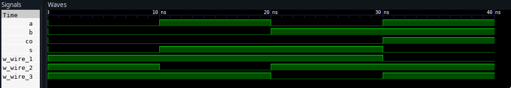
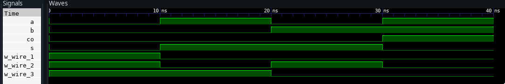
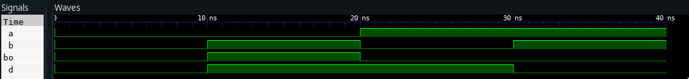
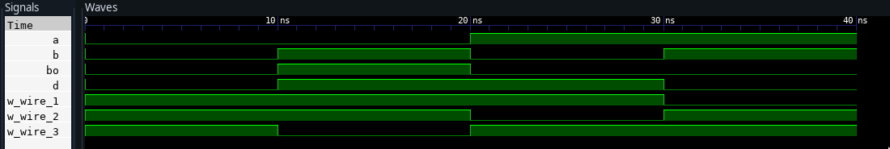
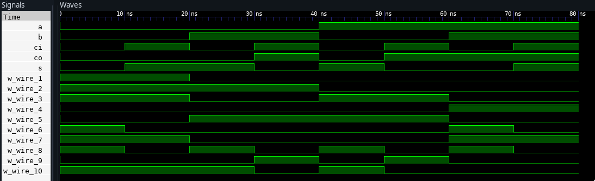
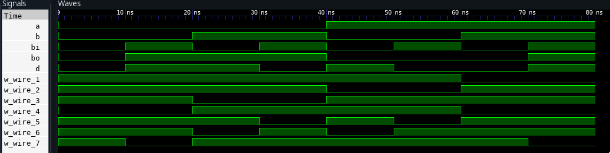
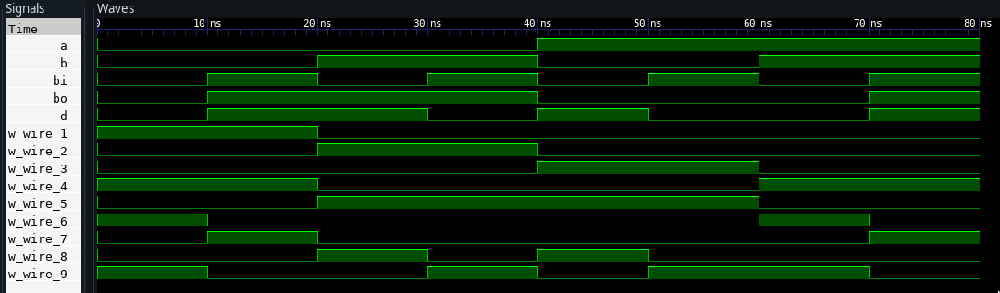

##  Aim:


1. Half Adder and Full Adder (using basic gates and universal gates).
2. Half subtractor and Full Subtractor (using basic gate and universal
   gates).

Using DataFlow style of Modelling


## Software Used:

GHDL

## Half Adder

A half adder is an arithmetic combinational logic circuit that adds two
1-bit inputs to give the sum and the carry generated as the output.

The half adder circuit adds two single bits and ignores any carry if
generated. Since any addition where a carry is present isn't complete
without adding the carry, the operation is not complete. Hence the
circuit is known as a half-adder. Let's write the truth table using
general boolean
logic
0 + 0 = 0

    0 + 1 = 1

    1 + 0 = 1

    1 + 1 = 0, carry 1


## Truth table for a half adder

| **A** | **B** | **SUM** | **CARRY** |
| ----- | ----- | ------- | --------- |
| 0     | 0     | 0       | 0         |
| 0     | 1     | 1       | 0         |
| 1     | 0     | 1       | 0         |
| 1     | 1     | 0       | 1         |


From the above table, SUM is one when A=0 _And_ B=1 _Or _(not and
because A and B can have only one value at a time) when A=1 _And_ B=0.
So we can say that

$SUM = A'B + AB'$

Similarly, for the CARRY output, it is 1 only when A=1 and B=1. Hence,

$CARRY = AB$

## Full Adder

The only difference between a full adder and a half adder is that in a
full adder, we also consider the carry input. So we have three inputs
instead of two. Let's plot the truth table using three inputs and
general.

### Truth table for a full adder

| **A** | **B** | **Y** | **SUM** | **CARRY** |
| ----- | ----- | ----- | ------- | --------- |
| 0     | 0     | 0     | 0       | 0         |
| 0     | 0     | 1     | 1       | 0         |
| 0     | 1     | 0     | 1       | 0         |
| 0     | 1     | 1     | 0       | 1         |
| 1     | 0     | 0     | 1       | 0         |
| 1     | 0     | 1     | 0       | 1         |
| 1     | 1     | 0     | 0       | 1         |
| 1     | 1     | 1     | 1       | 1         |


$$
SUM = A'B'Y + A'BY' + ABY + AB'Y' = Y(A'B'+AB) + Y'(A'B+AB') = YX'+Y'X= Y \oplus X = A \oplus B \oplus Y
$$


Where X is the equation for EXOR and X' is the equation for EXNOR.

$CARRY = AB + BY + AY = Y(A+B) + AB$

## Half Subtractor

Quite similar to the half adder, a half subtractor subtracts two 1-bit
binary numbers to give two outputs, difference and borrow. Since it
neglects any borrow inputs and essentially performs half the function of
a subtractor, it is known as the half subtractor. Let's write the truth
table based on this information and general binary subtraction
rules

    0 -- 0 = 0

    0 -- 1 = 1, borrow 1

    1 -- 0 = 1

    1 -- 1 = 0

### Truth table for a half subtractor

| **A** | **B** | **DIFFERENCE** | **BORROW** |
| ----- | ----- | -------------- | ---------- |
| 0     | 0     | 0              | 0          |
| 0     | 1     | 1              | 1          |
| 1     | 0     | 1              | 0          |
| 1     | 1     | 0              | 0          |


DIFFERENCE is high when A=0 _and_ B=1 _or_ when A=1 _and_ B=0. Hence

$DIFFERENCE= A'B + AB' = A \oplus B$

BORROW is high when A=0 _and_ B=1. Hence

$BORROW = A'B$

## Full Subtractor

A full subtractor accounts for the borrow that a half subtractor
neglects. Hence it has three inputs and two outputs. We will write the
truth table for the full subtractor based on this information.

### Truth table for a full subtractor


| **A** | **B** | **D** | **DIFFERENCE** | **BORROW** |
| ----- | ----- | ----- | -------------- | ---------- |
| 0     | 0     | 0     | 0              | 0          |
| 0     | 0     | 1     | 1              | 1          |
| 0     | 1     | 0     | 1              | 1          |
| 0     | 1     | 1     | 0              | 1          |
| 1     | 0     | 0     | 1              | 0          |
| 1     | 0     | 1     | 0              | 0          |
| 1     | 1     | 0     | 0              | 0          |
| 1     | 1     | 1     | 1              | 1          |


This is similar to the Kmap for SUM for the full adder. The equation for
DIFFERENCE is thus

$$
DIFFERENCE =A \oplus B \oplus Y
$$

Deriving the equation for BORROW

$BORROW = A'D + BD + A'B = A'(B+D) + BD$

\pagebreak

\pagebreak

## Circuit Diagrams

##  Half Adder using Basic Gates


{ width=80% }

##  Half Adder using Universal Gates


###  1. NAND GATE


{ width=80% }

###  2. NOR GATE


{ width=80% }

\pagebreak

##  Half Subtractor using Basic Gates


##  Half Subtractor using Universal Gates


###  1. NAND GATE


###  2. NOR GATE


\pagebreak

##  Full Adder using Basic Gates


##  Full Adder using Universal Gates


###  1. NAND GATE


###  2. NOR GATE


\pagebreak

##  Full Subtractor using Basic Gates


{ width=80% }

##  Full Subtractor using Universal Gates


###  1. NAND GATE


{ width=80% }

###  2. NOR GATE


{ width=80% }

\pagebreak

##  VHDL CODE:


##  Half Adder using Basic Gates


```vhdl
library ieee;
use ieee.std_logic_1164.all;

entity half_adder is
    port (
        a  : in  std_logic;
        b  : in  std_logic;
        s  : out std_logic;
        co : out std_logic);
end;

architecture HALF_ADDER of half_adder is
begin
	s <= ((not a) and b) or (a and (not b));
	co <= a and b;
end;


```

##  Half Adder using Universal Gates


###  1. NAND GATE


```vhdl
library ieee;
use ieee.std_logic_1164.all;

entity half_adder is
    port (
        a  : in  std_logic;
        b  : in  std_logic;
        s  : out std_logic;
        co : out std_logic);
end;

architecture HALF_ADDER of half_adder is
	 signal w_WIRE_1 : std_logic;
	 signal w_WIRE_2 : std_logic;
	 signal w_WIRE_3 : std_logic;
begin
	w_WIRE_1 <= a nand b;
	w_WIRE_2 <= w_WIRE_1 nand a;
	w_WIRE_3 <= w_WIRE_1 nand b;

	s <= w_WIRE_2 nand w_WIRE_3;
	co <= w_WIRE_1 nand w_WIRE_1;
end;


```

\pagebreak

###  2. NOR GATE


```vhdl
library ieee;
use ieee.std_logic_1164.all;

entity half_adder is
    port (
        a  : in  std_logic;
        b  : in  std_logic;
        s  : out std_logic;
        co : out std_logic);
end;

architecture HALF_ADDER of half_adder is
	 signal w_WIRE_1 : std_logic;
	 signal w_WIRE_2 : std_logic;
	 signal w_WIRE_3 : std_logic;
begin
	w_WIRE_1 <= a nor b;
	w_WIRE_2 <= a nor a;
	w_WIRE_3 <= b nor b;

	co <= w_WIRE_2 nor w_WIRE_3;
	s <= w_WIRE_1 nor (w_WIRE_2 nor w_WIRE_3);
end;


```

###  HALF ADDER WAVEFORMS






##  Half subtractor using Basic Gates


```vhdl
library ieee;
use ieee.std_logic_1164.all;

entity half_subtractor is
    port (
        a  : in  std_logic;
        b  : in  std_logic;
        d  : out std_logic;
        bo : out std_logic);
end;

architecture HALF_SUB of half_subtractor is
begin
	d <= ((not a) and b) or (a and (not b));
	bo <= (not a) and b;
end;


```

##  Half subtractor using Universal Gates


###  1. NAND GATE


```vhdl
library ieee;
use ieee.std_logic_1164.all;

entity half_subtractor is
    port (
        a  : in  std_logic;
        b  : in  std_logic;
        d  : out std_logic;
        bo : out std_logic);
end;

architecture HALF_SUB of half_subtractor is
	 signal w_WIRE_1 : std_logic;
	 signal w_WIRE_2 : std_logic;
	 signal w_WIRE_3 : std_logic;
begin
	w_WIRE_1 <= a nand b;
	w_WIRE_2 <= w_WIRE_1 nand a;
	w_WIRE_3 <= w_WIRE_1 nand b;

	d <= w_WIRE_2 nand w_WIRE_3;
	bo <= w_WIRE_3 nand w_WIRE_3;
end;


```

\pagebreak

###  2. NOR GATE


```vhdl
library ieee;
use ieee.std_logic_1164.all;
entity half_subtractor is
    port (
        a  : in  std_logic;
        b  : in  std_logic;
        d  : out std_logic;
        bo : out std_logic);
end;
architecture HALF_SUB of half_subtractor is
	 signal w_WIRE_1 : std_logic;
	 signal w_WIRE_2 : std_logic;
	 signal w_WIRE_3 : std_logic;
begin
	w_WIRE_1 <= a nor b;
	w_WIRE_2 <= a nor w_WIRE_1;
	w_WIRE_3 <= b nor w_WIRE_1;
	d <= (w_WIRE_2 nor w_WIRE_3) nor (w_WIRE_2 and w_WIRE_3) ;
	bo <= w_WIRE_2;
end;


```

###  HALF SUBTRACTOR WAVEFORMS







\pagebreak

##  Full Adder using Basic Gates


```vhdl
library ieee;
use ieee.std_logic_1164.all;
entity full_adder is
    port (
        a  : in  std_logic;
        b  : in  std_logic;
        ci : in  std_logic;
        s  : out std_logic;
        co : out std_logic);
end;
architecture ADDER of full_adder is
begin
    s <= ((not a) and (not b) and ci) or (a and (not b) and (not ci)) or ((not
	 a) and b and (not ci)) or (a and b and ci);
    co <= (a and b) or (b and ci) or (a and ci) ;
end;
```

##  Full Adder using Universal Gates


###  1. NAND GATE


```vhdl
library ieee;
use ieee.std_logic_1164.all;
entity full_adder is
    port (
        a  : in  std_logic;
        b  : in  std_logic;
        ci : in  std_logic;
        s  : out std_logic;
        co : out std_logic);
end;
architecture ADDER of full_adder is
	 signal w_WIRE_1 : std_logic;
	 signal w_WIRE_2 : std_logic;
	 signal w_WIRE_3 : std_logic;
	 signal w_WIRE_4 : std_logic;
	 signal w_WIRE_5 : std_logic;
	 signal w_WIRE_6 : std_logic;
	 signal w_WIRE_7 : std_logic;
begin
	w_WIRE_1 <= a nand b;
	w_WIRE_2 <= w_WIRE_1 nand a;
	w_WIRE_3 <= w_WIRE_1 nand b;
	w_WIRE_4 <= w_WIRE_2 nand w_WIRE_3;
	w_WIRE_5 <= w_WIRE_4 nand ci;
	w_WIRE_6 <= w_WIRE_5 nand w_WIRE_4;
	w_WIRE_7 <= w_WIRE_5 nand ci;

	s <= w_WIRE_6 nand w_WIRE_7;
	co <= w_WIRE_1 nand w_WIRE_5;
end;

```

###  2. NOR GATE


```vhdl
library ieee;
use ieee.std_logic_1164.all;

entity full_adder is
    port (
        a  : in  std_logic;
        b  : in  std_logic;
        ci : in  std_logic;
        s  : out std_logic;
        co : out std_logic);
end;

architecture ADDER of full_adder is
	 signal w_WIRE_1 : std_logic;
	 signal w_WIRE_2 : std_logic;
	 signal w_WIRE_3 : std_logic;
	 signal w_WIRE_4 : std_logic;
	 signal w_WIRE_5 : std_logic;
	 signal w_WIRE_6 : std_logic;
	 signal w_WIRE_7 : std_logic;
	 signal w_WIRE_8 : std_logic;
	 signal w_WIRE_9 : std_logic;
	 signal w_WIRE_10: std_logic;
begin
	w_WIRE_1 <= a nor b;
	w_WIRE_2 <= a nor a;
	w_WIRE_3 <= b nor b;
	w_WIRE_4 <= w_WIRE_2 nor w_WIRE_3;
	w_WIRE_5 <= w_WIRE_4 nor w_WIRE_1;
	w_WIRE_6 <= w_WIRE_5 nor ci;
	w_WIRE_7 <= w_WIRE_5 nor w_WIRE_5;
	w_WIRE_8 <= ci nor ci;
	w_WIRE_9 <= w_WIRE_8 nor w_WIRE_7;
	w_WIRE_10<= w_WIRE_4 nor w_WIRE_9;

	s <= w_WIRE_9 nor w_WIRE_6;
	co <= w_WIRE_10 nor w_WIRE_10;
end;

```

\pagebreak

###  FULL ADDER WAVEFORMS




\pagebreak

##  Full subtractor using Basic Gates


```vhdl
library ieee;
use ieee.std_logic_1164.all;
entity full_subtractor is
    port (
        a  : in  std_logic;
        b  : in  std_logic;
        bi : in  std_logic;
        d  : out std_logic;
        bo : out std_logic);
end;
architecture SUB of full_subtractor is
begin
    d <= ((not a) and (not b) and bi) or (a and (not b) and (not bi)) or ((not
	 a) and b and (not bi)) or (a and b and bi);
    bo <= (b and bi) or ((not a) and b) or ((not a) and bi);
end;

```

##  Full subtractor using Universal Gates


###  1. NAND GATE


```vhdl
library ieee;
use ieee.std_logic_1164.all;
entity full_subtractor is
    port (
        a  : in  std_logic;
        b  : in  std_logic;
        bi : in  std_logic;
        d  : out std_logic;
        bo : out std_logic);
end;
architecture SUB of full_subtractor is
	 signal w_WIRE_1 : std_logic;
	 signal w_WIRE_2 : std_logic;
	 signal w_WIRE_3 : std_logic;
	 signal w_WIRE_4 : std_logic;
	 signal w_WIRE_5 : std_logic;
	 signal w_WIRE_6 : std_logic;
	 signal w_WIRE_7 : std_logic;
begin
	w_WIRE_1 <= a nand b;
	w_WIRE_2 <= w_WIRE_1 nand a;
	w_WIRE_3 <= w_WIRE_1 nand b;
	w_WIRE_4 <= w_WIRE_2 nand w_WIRE_3;
	w_WIRE_5 <= w_WIRE_4 nand bi;
	w_WIRE_6 <= w_WIRE_5 nand w_WIRE_4;
	w_WIRE_7 <= w_WIRE_5 nand bi;

	d <= w_WIRE_6 nand w_WIRE_7;
	bo <= w_WIRE_3 nand w_WIRE_7;
end;

```

###  2. NOR GATE


```vhdl
library ieee;
use ieee.std_logic_1164.all;

entity full_subtractor is
    port (
        a  : in  std_logic;
        b  : in  std_logic;
        bi : in  std_logic;
        d  : out std_logic;
        bo : out std_logic);
end;

architecture SUB of full_subtractor is
	 signal w_WIRE_1 : std_logic;
	 signal w_WIRE_2 : std_logic;
	 signal w_WIRE_3 : std_logic;
	 signal w_WIRE_4 : std_logic;
	 signal w_WIRE_5 : std_logic;
	 signal w_WIRE_6 : std_logic;
	 signal w_WIRE_7 : std_logic;
	 signal w_WIRE_8 : std_logic;
	 signal w_WIRE_9 : std_logic;

begin
	w_WIRE_1 <= a nor b;
	w_WIRE_2 <= w_WIRE_1 nor a;
	w_WIRE_3 <= w_WIRE_1 nor b;
	w_WIRE_4 <= w_WIRE_2 nor w_WIRE_3;
	w_WIRE_5 <= w_WIRE_4 nor w_WIRE_4;
	w_WIRE_6 <= w_WIRE_5 nor bi;
	w_WIRE_7 <= w_WIRE_5 nor w_WIRE_6;
	w_WIRE_8 <= w_WIRE_6 nor bi;
	w_WIRE_9 <= w_WIRE_8 nor w_WIRE_7;


	d <= w_WIRE_9 nor w_WIRE_9;
	bo <= (w_WIRE_2 nor w_WIRE_7) nor (w_WIRE_2 nor w_WIRE_7);
end;

```

\pagebreak

###  FULL SUBTRACTOR WAVEFORMS






## RESULT

For the following circuits, vhdl code was written and compiled. The waveforms
were generated and studied.

1. Half Adder and Full Adder (using basic gates and universal gates).
2. Half subtractor and Full Subtractor (using basic gate and universal
   gates).

Using DataFlow style of Modelling


\pagebreak

