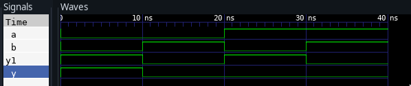

**Aim:** Design

1. 4:1 Multiplexer with enable
2. 3:8 Decoder with enable
3. 4:2 Priority Encoder
4. 1:4 Demux

> using Dataflow style of modeling

5. Implementation of gates usin Mux using structural style of
   modelling

**Software Used** : GHDL and GTKWAVE

**Theory**

###  4x1 Multiplexer


Multiplexer is a combinational circuit that has maximum of 2^n^ data
inputs, 'n' selection lines and single output line. One of these data
inputs will be connected to the output based on the values of
selection lines.
4x1 Multiplexer has four data inputs I~3~, I~2~, I~1~ & I~0~, two
selection lines s~1~ & s~0~ and one output Y. The block diagram of 4x1
Multiplexer is shown in the following figure.

{width=50%}
{width="35%"}
\begin{figure}[!h]
\begin{subfigure}[]{0.6\textwidth}
\caption{4x1 Multiplexer}
\end{subfigure}
\hfill
\begin{subfigure}[]{0.4\textwidth}
\caption{4 to 1 Multiplexer Circuit Diagram}
\end{subfigure}
\caption{}
\end{figure}

Selection Lines    Output
----------------- -------- ------
S~1~              S~0~     Y
  0                 0        I~0~
  0                 1        I~1~
  1                 0        I~2~
  1                 1        I~3~

From Truth table, we can directly write the Boolean function for
output, Y as

$Y=S_1'S_0'I_0+S_1'S_0I_1+S_1S_0'I_2+S_1S_0I_3$

\pagebreak

##   3:8 Decoder:


A decoder is a combinational logic
circuit which is used to change the code into a set of signals. It is the reverse
process of an encoder. A decoder circuit takes multiple inputs and gives
multiple outputs. A decoder circuit takes binary data of 'n' inputs into
$2^n$ unique output. In addition to input pins, the decoder has a
enable pin. This enables the pin when negated, makes the circuit
inactive.

{width="53%"}
{width="33%"}
\begin{figure}[!h]
\begin{subfigure}[]{0.6\textwidth}
\caption{3 to 8 decoder block diagram}
\end{subfigure}
\hfill
\begin{subfigure}[]{0.4\textwidth}
\caption{3 to 8 decoder circuit}
\end{subfigure}
\caption{}
\end{figure}

The decoder circuit works only when the Enable pin (E) is high. S0, S1
and S2 are three different inputs and D0, D1, D2, D3. D4. D5. D6. D7 are
the eight outputs.

Truth Table:

  S0   S1   S2   E   D0   D1   D2   D3   D4   D5   D6   D7
  ---- ---- ---- --- ---- ---- ---- ---- ---- ---- ---- ----
  x    x    x    0   0    0    0    0    0    0    0    0
  0    0    0    1   0    0    0    0    0    0    0    1
  0    0    1    1   0    0    0    0    0    0    1    0
  0    1    0    1   0    0    0    0    0    1    0    0
  0    1    1    1   0    0    0    0    1    0    0    0
  1    0    0    1   0    0    0    1    0    0    0    0
  1    0    1    1   0    0    1    0    0    0    0    0
  1    1    0    1   0    1    0    0    0    0    0    0
  1    1    1    1   1    0    0    0    0    0    0    0

The below table gives the truth table of 3 to 8 line decoder.

When the Enable pin (E) is low all the output pins are low.

##   Priority Encoder:


A 4 to 2 priority encoder has 4 inputs : Y3, Y2, Y1 & Y0 and 2 outputs :
A1 & A0. Here, the input, Y3 has the highest priority, whereas the
input, Y0 has the lowest priority. In this case, even if more than one
input is '1' at the same time, the output will be the (binary) code
corresponding to the input, which is having higher priority.

The truth table for priority encoder is as follows :

{width="3.8583333333333334in"
height="2.0833333333333335in"}

{width="3.8583333333333334in"
height="2.0833333333333335in"}
{width="3.8583333333333334in"
height="2.0833333333333335in"}
\begin{figure}[!h]
\begin{subfigure}[]{0.6\textwidth}
\end{subfigure}
\hfill
\begin{subfigure}[]{0.4\textwidth}
\end{subfigure}
\caption{}
\end{figure}

The above two Boolean functions can be implemented as :

{width="50%"}

\pagebreak

##   1x4 De-Multiplexer:


1x4 De-Multiplexer has one input I, two selection lines, s~1~ &
s~0~ and four outputs Y~3~, Y~2~, Y~1~ &Y~0~. The block diagram of 1x4
De-Multiplexer is shown in the following figure.

{width="60%"}
{width="40%"}
\begin{figure}[!h]
\begin{subfigure}[]{0.6\textwidth}
\caption{1 to 4 De-Multiplexer}
\end{subfigure}
\hfill
\begin{subfigure}[]{0.4\textwidth}
\caption{3 to 8 decoder block diagram}
\end{subfigure}
\caption{}
\end{figure}

The single input 'I' will be connected to one of the four outputs,
Y~3~ to Y~0~ based on the values of selection lines s~1~ & s0.
The Truth table of 1x4 De-Multiplexer is shown below.

  Selection Inputs   Outputs
  ------------------ --------- ------ ------ ------ ------
  S~1~               S~0~      Y~3~   Y~2~   Y~1~   Y~0~
  0                  0         0      0      0      I
  0                  1         0      0      I      0
  1                  0         0      I      0      0
  1                  1         I      0      0      0


From the above Truth table, we can directly write the Boolean
functions for each output as


$$Y_3=S_1S_0IY_3=S_1S_0I
$$

$$Y_2=S_1S_0'IY_2=S_1S_0'I
$$

$$Y_1=S_1'S_0IY_1=S_1'S_0I
$$

$$
Y_0=S_1'S_0'IY_0=S_1'S_0'I
$$


\pagebreak

##   Gates using 2:1 MUX:


###   NOT Gate :


{width="80%"}

We can analyze it

$Y = X'.1 + X.0 = X'$

It is NOT Gate using 2:1 MUX.
The implementation of NOT gate is done using "n" selection lines. It
cannot be implemented using "n-1" selection lines. Only NOT gate cannot
be implemented using "n-1" selection lines.

###   AND GATE


{width="80%"}

This implementation is done using "n-1" selection lines.

##   OR GATE


{width="80%"}

\pagebreak

Implementation of NAND, NOR, XOR and XNOR gates requires two 2:1 Mux.
First multiplexer will act as NOT gate which will provide complemented
input to the second multiplexer.

##   NAND GATE


{width="60%" }

##   NOR GATE


{width="60%" }

##   EX-OR GATE


{width="60%" }

##   EX-NOR GATE


{width="60%" }

\pagebreak

##   Program Code


###  4:1 MUX:


```vhdl
library IEEE;
use IEEE.STD_LOGIC_1164.ALL;

entity MUX4_1 is
    Port ( i : in  STD_LOGIC_VECTOR (3 downto 0);
           s : in  STD_LOGIC_VECTOR (1 downto 0);
           y : out  STD_LOGIC);
end MUX4_1;

architecture dataflow of MUX4_1 is

begin

with s select
y <=     i(0) when "00",
         i(1) when "01",
         i(2) when "10",
         i(3) when others;

end ;


```

###  3:8 Decoder


```vhdl
library ieee;
use ieee.std_logic_1164.all;
entity decoder is
port(
	i0,i1,i2,E: in std_logic;
	d : out STD_LOGIC_VECTOR (7 downto 0));
end decoder;

architecture decod of decoder is
begin
	d(0)<=(not i0) and (not i1) and (not i2) and E;
	d(1)<=(not i0) and (not i1) and i2 and E;
	d(2)<=(not i0) and i1 and (not i2) and E;
	d(3)<=(not i0) and i1 and i2 and E;
	d(4)<=i0 and (not i1) and (not i2) and E;
	d(5)<=i0 and (not i1) and i2 and E;
	d(6)<=i0 and i1 and (not i2) and E;
	d(7)<=i0 and i1 and i2 and E;
end ;

```

\pagebreak

###  Priority Encoder


```vhdl
library ieee;
use ieee.std_logic_1164.all;

entity pencoder is
	port(
		i : in STD_LOGIC_VECTOR (3 downto 0);
		a0,a1,v: out std_logic);
end pencoder;

architecture enc of pencoder is
begin
	a1<=i(3) or i(2);
	a0<=i(3) or (not(i(2))and i(1));
	v<= i(0) or i(1) or i(2) or i(3);
end;

```

###  DEMUX


```vhdl
library IEEE;
use IEEE.STD_LOGIC_1164.ALL;

entity DEMUX is
Port (
	     I : in STD_LOGIC;
	     S : in STD_LOGIC_VECTOR (1 downto 0);
	     Y : out STD_LOGIC_VECTOR (3 downto 0)
     );
end DEMUX;

architecture demux of DEMUX is
begin
	with S select Y <=
              ("000" & I) when "00",
              ("00" & I & "0") when "01",
              ("0" & I & "00") when "10",
              (I & "000") when others;

end;

```

\pagebreak

###  GATES USING MUX:


####  AND GATE


```vhdl
library ieee;
use ieee.std_logic_1164.all;
entity andgate is
port(
	A:IN std_logic;
	B:IN std_logic;
	Y:OUT std_logic
);
end andgate;

architecture sms of andgate is
component mux is
port(
	I0:IN std_logic;
	I1:IN std_logic;
	S1:IN std_logic;
	y: OUT std_logic
);
end component;

begin
	mux1:mux port map(I0=>'0',I1=>B,S1=>A,y=>Y);
end;

library IEEE;
use IEEE.std_logic_1164.all;
entity mux is
port(
	I0:IN std_logic;
	I1:IN std_logic;
	S1:IN std_logic;
	y:OUT std_logic
);
end mux;
architecture andgate_arch of mux is
	begin
	y<= I0 when S1='0' Else
	I1;
end;

```

\pagebreak

####  OR GATE


```vhdl
library ieee;
use ieee.std_logic_1164.all;
entity orgate is
port(
	A:IN std_logic;
	B:IN std_logic;
	Y:OUT std_logic
);
end orgate;

architecture sms of orgate is
component mux is
port(
	I0:IN std_logic;
	I1:IN std_logic;
	S1:IN std_logic;
	y: OUT std_logic
);
end component;

begin
	mux1:mux port map(I0=>B,I1=>'1',S1=>A,y=>Y);
end;

library IEEE;
use IEEE.std_logic_1164.all;
entity mux is
port(
	I0:IN std_logic;
	I1:IN std_logic;
	S1:IN std_logic;
	y:OUT std_logic
);
end mux;
architecture orgate_arch of mux is
	begin
	y<= I0 when S1='0' Else
	I1;
end;

```
\pagebreak

####  NOT GATE


```vhdl
library ieee;
use ieee.std_logic_1164.all;
entity notgate is
port(
	A:IN std_logic;
	B:IN std_logic;
	Y:OUT std_logic
);
end notgate;

architecture sms of notgate is
component mux is
port(
	I0:IN std_logic;
	I1:IN std_logic;
	S1:IN std_logic;
	y: OUT std_logic
);
end component;

begin
	mux1:mux port map(I0=>'1',I1=>'0',S1=>B,y=>Y);
end;

library IEEE;
use IEEE.std_logic_1164.all;
entity mux is
port(
	I0:IN std_logic;
	I1:IN std_logic;
	S1:IN std_logic;
	y:OUT std_logic
);
end mux;
architecture notgate_arch of mux is
	begin
	y<= I0 when S1='0' Else
	I1;
end ;

```

\pagebreak

####  NAND GATE


```vhdl
library ieee;
use ieee.std_logic_1164.all;

entity nandgate is
	port(
		A:IN std_logic;
		B:IN std_logic;
		Y:OUT std_logic
	);
end nandgate;

architecture sms of nandgate is
component mux is
	port(
		I0:IN std_logic;
		I1:IN std_logic;
		S1:IN std_logic;
		y:OUT std_logic
	);
	end component;
signal Y1:std_logic;
begin
	mux1:mux port map(I0=>'1',I1=>'0',S1=>B,y=>Y1);
	mux2:mux port map(I0=>'1',I1=>Y1,S1=>A,y=>Y);
end;

library IEEE;
use IEEE.std_logic_1164.all;

entity mux is
	port(
		I0:IN std_logic;
		I1:IN std_logic;
		S1:IN std_logic;
		y:OUT std_logic
	);
end mux;
architecture nandgate_arch of mux is
	begin
		y<= I0 when S1='0' Else
		I1;
end ;

```

\pagebreak

####  NOR GATE


```vhdl
library ieee;
use ieee.std_logic_1164.all;

entity norgate is
	port(
		A:IN std_logic;
		B:IN std_logic;
		Y:OUT std_logic
	);
end norgate;

architecture sms of norgate is
component mux is
	port(
		I0:IN std_logic;
		I1:IN std_logic;
		S1:IN std_logic;
		y:OUT std_logic
	);
	end component;
signal Y1:std_logic;
begin
	mux1:mux port map(I0=>'1',I1=>'0',S1=>B,y=>Y1);
	mux2:mux port map(I0=>Y1,I1=>'0',S1=>A,y=>Y);
end;

library IEEE;
use IEEE.std_logic_1164.all;

entity mux is
	port(
		I0:IN std_logic;
		I1:IN std_logic;
		S1:IN std_logic;
		y:OUT std_logic
	);
end mux;
architecture norgate_arch of mux is
	begin
		y<= I0 when S1='0' Else
		I1;
end ;

```

\pagebreak

####  XOR GATE


```vhdl
library ieee;
use ieee.std_logic_1164.all;

entity xorgate is
	port(
		A:IN std_logic;
		B:IN std_logic;
		Y:OUT std_logic
	);
end xorgate;

architecture sms of xorgate is
component mux is
	port(
		I0:IN std_logic;
		I1:IN std_logic;
		S1:IN std_logic;
		y:OUT std_logic
	);
	end component;
signal Y1:std_logic;
begin
	mux1:mux port map(I0=>'1',I1=>'0',S1=>B,y=>Y1);
	mux2:mux port map(I0=>B,I1=>Y1,S1=>A,y=>Y);
end;

library IEEE;
use IEEE.std_logic_1164.all;

entity mux is
	port(
		I0:IN std_logic;
		I1:IN std_logic;
		S1:IN std_logic;
		y:OUT std_logic
	);
end mux;
architecture xorgate_arch of mux is
	begin
		y<= I0 when S1='0' Else
		I1;
end ;

```

\pagebreak

####  XNOR GATE


```vhdl
library ieee;
use ieee.std_logic_1164.all;

entity xnorgate is
	port(
		A:IN std_logic;
		B:IN std_logic;
		Y:OUT std_logic
	);
end xnorgate;

architecture sms of xnorgate is
component mux is
	port(
		I0:IN std_logic;
		I1:IN std_logic;
		S1:IN std_logic;
		y:OUT std_logic
	);
	end component;
signal Y1:std_logic;
begin
	mux1:mux port map(I0=>'1',I1=>'0',S1=>B,y=>Y1);
	mux2:mux port map(I0=>Y1,I1=>B,S1=>A,y=>Y);
end;

library IEEE;
use IEEE.std_logic_1164.all;

entity mux is
	port(
		I0:IN std_logic;
		I1:IN std_logic;
		S1:IN std_logic;
		y:OUT std_logic
	);
end mux;
architecture xnorgate_arch of mux is
	begin
		y<= I0 when S1='0' Else
		I1;
end ;

```
\pagebreak

## WAVEFORM

###  4:1 MUX:


###  3:8 Decoder


###  Priority Encoder


###  DEMUX

.

\pagebreak

## GATES USING MUX

###  AND GATE


###  OR GATE


###  NOT GATE


\pagebreak

###  NAND GATE


###  NOR GATE

.


###  XOR GATE


###  XNOR GATE


## Result:
Hence we have studied and programmed the following circuits in vhdl.
