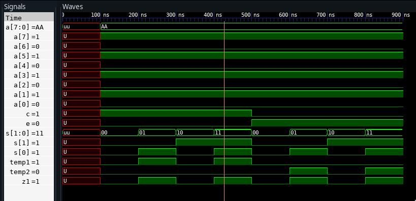

---
geometry:
    - top=3cm
    - left=3cm
    - right=3cm
    - bottom=2cm
---

#  Codes


##  1. 4:1 Mux using 2:1 Mux


```vhdl
library IEEE;
use IEEE.STD_LOGIC_1164.ALL;

entity mux4_1 is
port(
	A,B,C,D : in STD_LOGIC;
	S0,S1: in STD_LOGIC;
	Z: out STD_LOGIC
);
end mux4_1;

architecture smsa of mux4_1 is
component mux2_1
port(
	A,B : in STD_LOGIC;
	S: in STD_LOGIC;
	Z: out STD_LOGIC
);
end component;

signal temp1, temp2: std_logic;
begin
	m1: mux2_1 port map(A,B,S0,temp1);
	m2: mux2_1 port map(C,D,S0,temp2);
	m3: mux2_1 port map(temp1,temp2,S1,Z);
end smsa;

library IEEE;
use IEEE.STD_LOGIC_1164.ALL;

entity mux2_1 is
port(
	A,B:in STD_LOGIC;
	S:in STD_LOGIC;
	Z:out STD_LOGIC
);
end mux2_1;

architecture sms of mux2_1 is
begin
 with S select
	Z<= A when '0',
	B when others;
end sms;


```

\pagebreak

##  2. 8:1 Mux using 2:1 Mux and 4:1 Mux


```vhdl
library IEEE;
use IEEE.STD_LOGIC_1164.ALL;

entity mux8_1 is
port(
	A,B,C,D,E,F,G,H : in STD_LOGIC;
	S2,S1,S0: in STD_LOGIC;
	Z1: out STD_LOGIC
);
end mux8_1;

architecture smsa of mux8_1 is
component mux2_1
port(
	A,B:in STD_LOGIC;
	S2: in STD_LOGIC;
	Z: out STD_LOGIC
);
end component;

component mux4_1
port(
	A,B,C,D : in STD_LOGIC;
	S0,S1: in STD_LOGIC;
	Z: out STD_LOGIC
);
end component;

signal temp1, temp2: std_logic;
begin
	m1: mux4_1 port map(A,B,C,D,S0,S1,temp1);
	m2: mux4_1 port map(E,F,G,H,S0,S1,temp2);
	m3: mux2_1 port map(temp1,temp2,S2,Z1);

end smsa;


library IEEE;
use IEEE.STD_LOGIC_1164.ALL;

entity mux4_1 is
port(
    A,B,C,D : in STD_LOGIC;
    S0,S1 : in STD_LOGIC;
    Z : out STD_LOGIC
);
end mux4_1;

architecture sms of mux4_1 is
begin
	process (A,B,C,D,S0,S1) is
	begin
		  if (S0 ='0' and S1 = '0') then
		      Z <= A;
		  elsif (S0 ='1' and S1 = '0') then
		      Z <= B;
		  elsif (S0 ='0' and S1 = '1') then
		      Z <= C;
		  else
		      Z <= D;
	      end if;
	end process;
end sms;


library IEEE;
use IEEE.STD_LOGIC_1164.ALL;

entity mux2_1 is
port(
	A,B:in STD_LOGIC;
	S2:in STD_LOGIC;
	Z:out STD_LOGIC
);
end mux2_1;

architecture sms of mux2_1 is
begin
 with S2 select
	Z<= A when '0',
	B when others;
end sms;


```
\pagebreak

##  3. 8:1 Mux using 4:1 mux and OR gate


```vhdl
library IEEE;
use IEEE.STD_LOGIC_1164.ALL;

entity mux8_1 is
port(
	A : in STD_LOGIC_VECTOR(7 downto 0);
	S: in STD_LOGIC_VECTOR(1 downto 0);
	E:in STD_LOGIC;
	Z1: out STD_LOGIC
);
end mux8_1;

architecture smsb of mux8_1 is
component orgate
	port(
		A,B:in STD_LOGIC;
		Z: out STD_LOGIC
	);
	end component;

component multiplexer_4_1
	port(
		A : in STD_LOGIC_VECTOR(3 downto 0);
	        S : in STD_LOGIC_VECTOR(1 downto 0);
		E:in STD_LOGIC;
	Z: out STD_LOGIC);
	end component;
signal temp1, temp2,C: std_logic;
begin
	C<=not(E);
	m1: multiplexer_4_1 port map(A(3 downto 0),S,C,temp1);
	m2: multiplexer_4_1 port map(A(7 downto 4),S,E,temp2);
	m3: orgate port map(temp1,temp2,Z1);
end smsb;

library IEEE;
use IEEE.STD_LOGIC_1164.all;

entity multiplexer_4_1 is
port(
	A : in STD_LOGIC_VECTOR(3 downto 0);
	S : in STD_LOGIC_VECTOR(1 downto 0);
	E:in STD_LOGIC;
	Z : out STD_LOGIC
);
end multiplexer_4_1;

architecture multiplexer4_1_arc of multiplexer_4_1 is
begin
	with S select
	Z <= A(0) and E when "00" ,
	A(1) and E when "01" ,
	A(2) and E when "10" ,
	A(3) and E when others;
end multiplexer4_1_arc;


library IEEE;
use IEEE.STD_LOGIC_1164.ALL;

entity orgate is
port(
	A,B:in STD_LOGIC;
	Z:out STD_LOGIC
);
end orgate;

architecture sms of orgate is
begin
	Z<=A or B;
end sms;


```

\pagebreak

##  4. 16:1 Mux using 4:1 Mux


```vhdl
library IEEE;
use IEEE.STD_LOGIC_1164.ALL;

entity mux16_1 is
	port(
	A : in STD_LOGIC_VECTOR(15 downto 0);
	S : in STD_LOGIC_VECTOR( 3 downto 0);
	Z1: out STD_LOGIC
);
end mux16_1;

architecture smsb of mux16_1 is
	component multiplexer_4_1
		port(
		A : in STD_LOGIC_VECTOR( 3 downto 0);
		S : in STD_LOGIC_VECTOR( 1 downto 0);
		Z : out STD_LOGIC
	);
	end component;

	signal temp: STD_LOGIC_VECTOR(3 downto 0);
begin
	m1: multiplexer_4_1 port map( A(3 downto 0), S(1 downto 0), temp(0));
	m2: multiplexer_4_1 port map( A(7 downto 4), S(1 downto 0), temp(1));
	m3: multiplexer_4_1 port map( A(11 downto 8), S(1 downto 0), temp(2));
	m4: multiplexer_4_1 port map( A(15 downto 12), S(1 downto 0), temp(3));
	m5: multiplexer_4_1 port map(temp, S(3 downto 2), Z1);
end smsb;

library IEEE;
use IEEE.STD_LOGIC_1164.ALL;

entity multiplexer_4_1 is
	port(
         A : in STD_LOGIC_VECTOR( 3 downto 0);
         S : in STD_LOGIC_VECTOR(1 downto 0);
         Z : out STD_LOGIC
         );
end multiplexer_4_1;

architecture multiplexer4_1_arc of multiplexer_4_1 is
begin
	with S select
		Z <= A(0) when "00",
		     A(1) when "01",
		     A(2) when "10",
		     A(3) when others;
end multiplexer4_1_arc;

```

\pagebreak

##  5. Full Adder using Half Adder


```vhdl
library IEEE;
use IEEE.STD_LOGIC_1164.ALL;

entity fulladder is
port(
A : in STD_LOGIC;
B: in STD_LOGIC;
C: in STD_LOGIC;
S:out STD_LOGIC;
CA: out STD_LOGIC
);
end fulladder;

architecture smsb of fulladder is
component orgate
port( A,B:in STD_LOGIC;
Z: out STD_LOGIC);
end component;

component half_adder
port( a : in STD_LOGIC;
b: in STD_LOGIC;
sum:out STD_LOGIC;
carry: out STD_LOGIC);
end component;

signal sum1,carry1,carry2: std_logic;
begin
m1: half_adder port map(A,B,sum1,carry1);
m2: half_adder port map(C,sum1,S,carry2);
m3: orgate port map(carry1,carry2,CA);

end smsb;


library IEEE;
use IEEE.STD_LOGIC_1164.ALL;
entity half_adder is
   port(a,b:in STD_LOGIC; sum,carry:out STD_LOGIC);
end half_adder;

architecture halfadder of half_adder is
begin
   sum<= a xor b;
   carry <= a and b;
end halfadder;

library IEEE;
use IEEE.STD_LOGIC_1164.ALL;

entity orgate is
port(A,B:in STD_LOGIC;
Z : out STD_LOGIC);
end orgate;
architecture sms of orgate is
begin
	Z <= A or B;
end sms;

```

##  6. Full Subtractor using Half Subtractor


```vhdl
library IEEE;
use IEEE.STD_LOGIC_1164.ALL;

entity fullsubtractor is
port(
A : in STD_LOGIC;
B: in STD_LOGIC;
C: in STD_LOGIC;
D:out STD_LOGIC;
BO: out STD_LOGIC
);
end fullsubtractor;

architecture smsb of fullsubtractor is
	component orgate
		port( A,B:in STD_LOGIC;
		Z : out STD_LOGIC);
	end component;

	component half_subtractor
		port( a: in STD_LOGIC;
		b: in STD_LOGIC;
		diff : out STD_LOGIC;
		borrow: out STD_LOGIC);
	end component;

	signal sum1,carry1,carry2: std_logic;
	begin
	m1: half_subtractor port map(A,B,sum1,carry1);
	m2: half_subtractor port map(C,sum1,D,carry2);
	m3: half_subtractor port map(carry1, carry2, BO);
end smsb;

library IEEE;
use IEEE.STD_LOGIC_1164.ALL;

entity half_subtractor is
   port(a,b:in STD_LOGIC; diff,borrow:out STD_LOGIC);
end half_subtractor;
architecture halfsubtractor of half_subtractor is
begin
	diff <= a xor b;
	borrow <= not(a) and b;
end halfsubtractor;

```

\pagebreak

# Outputs

##  1. 4:1 Mux using 2:1 Mux


##  2. 8:1 Mux using 2:1 Mux and 4:1 Mux


\pagebreak

##  3. 8:1 mux using 4:1 mux and or gate



##  4. 16:1 Mux using 4:1 Mux


\pagebreak

##  5. Full Adder using Half Adder


##  6. Full Subtractor using Half Subtractor


