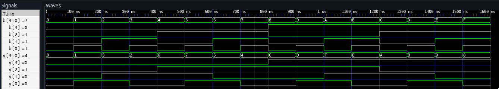
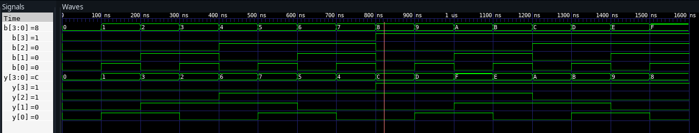
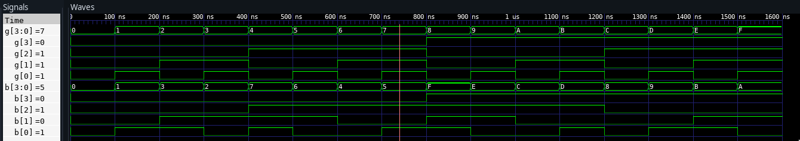
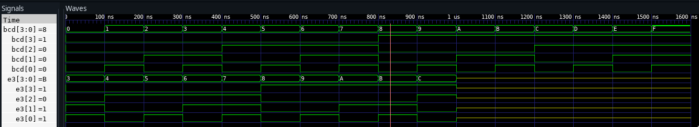

#  Codes


##  1. Binary To Gray Code Converter


###  Dataflow


```vhdl
library ieee;
use ieee.std_logic_1164.all;

entity bin2gray is
port(b: in std_logic_vector (3 downto 0);
     y: out std_logic_vector (3 downto 0));
end bin2gray;

architecture arch_bin2gray of bin2gray is
begin
	y(3) <= b(3);
	y(2) <= b(3) xor b(2);
	y(1) <= b(2) xor b(1);
	y(0) <= b(1) xor b(0);
end arch_bin2gray;
```

###  Behavorial

```vhdl
library ieee;
use ieee.std_logic_1164.all;

entity bin2gray_behav is
port(b: in bit_vector (3 downto 0);
     y: out bit_vector (3 downto 0));
end bin2gray_behav;

architecture arch_bin2gray_behav of bin2gray_behav is
begin

process(b)
  begin
    y(3) <= b(3);
    for i in 3 downto 1 loop

	      if ( b(i) = b(i-1)) then y(i-1) <= '0';
	      elsif ( b(i) /= b(i-1)) then y(i-1) <= '1';
	      end if;
	end loop;
      end process;

end arch_bin2gray_behav;
```

##  2. Gray Code to Binary Converter


###  Dataflow


```vhdl
library ieee;
use ieee.std_logic_1164.all;

entity gray2bin is
port(g: in std_logic_vector (3 downto 0);
     b: out std_logic_vector (3 downto 0));
end gray2bin;

architecture arch_gray2bin of gray2bin is
begin
	b(3) <= g(3);
	b(2) <= g(3) xor g(2);
	b(1) <= g(3) xor g(2) xor g(1);
	b(0) <= g(3) xor g(2) xor g(1) xor g(0);
end arch_gray2bin;


```

###  Behavorial


```vhdl
library ieee;
use ieee.std_logic_1164.all;

entity gray2bin_behav is
port(g: in bit_vector (3 downto 0);
     b: inout bit_vector (3 downto 0));
end gray2bin_behav;

architecture arch_gray2bin_behav of gray2bin_behav is
begin

process(g)
  begin
    b(3) <= g(3);

    for i in 2 downto 0 loop
	      if ( b(i+1) = g(i)) then b(i) <= '0';
	      elsif ( b(i+1) /= g(i)) then b(i) <= '1';
	      end if;
	    end loop;
      end process;
end arch_gray2bin_behav;


```

##  3. BCD to Excess-3


###  Dataflow


```vhdl
library ieee;
use ieee.std_logic_1164.all;

entity bcd2excess3 is
port(bcd: in std_logic_vector (3 downto 0);
     e3: out std_logic_vector (3 downto 0));
end bcd2excess3;

architecture arch_bcd2excess3 of bcd2excess3 is
begin
e3(3) <= bcd(3) or (bcd(2) and (bcd(1) or bcd(0)) );
e3(2) <= ( (not bcd(2)) and (bcd(1) or bcd(0)) ) or ( bcd(2) and
(not bcd(1)) and (not bcd(0)) );
e3(1) <= bcd(1) xnor bcd(0);
e3(0) <= not bcd(0);
end arch_bcd2excess3;
```

###  Behavorial


```vhdl
library ieee;
use ieee.std_logic_1164.all;
use ieee.numeric_std.all;

entity bcd2excess3 is
port(bcd: in std_logic_vector (3 downto 0);
     e3: out std_logic_vector (3 downto 0));
end bcd2excess3;

architecture arch_bcd2excess3 of bcd2excess3 is
begin
  with bcd select
	  e3 <= "0011" WHEN "0000",
		"0100" when "0001",
		"0101" when "0010",
		"0110" when "0011",
		"0111" when "0100",
		"1000" when "0101",
		"1001" when "0110",
		"1010" when "0111",
		"1011" when "1000",
		"1100" when "1001",
		"1101" when "1010",
		"1110" when "1011",
		"1111" when "1100",
		"0000" when "1101",
		"0001" when "1110",
		"0010" when others;
end arch_bcd2excess3;
```

# Outputs


##  1. Binary To Gray Code Converter

###  Dataflow



###  Behavorial



##  2. Gray Code to Binary Converter

###  Dataflow



\pagebreak

###  Behavorial


##  3. BCD to Excess-3

###  Dataflow



###  Behavorial


