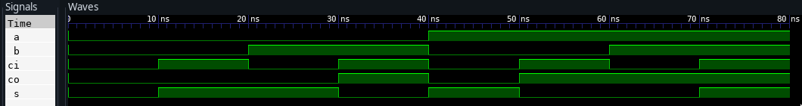

---
geometry:
  - top=1cm
  - left=3cm
  - right=3cm
  - bottom=1cm
---

# Codes

## Full Adder vhdl code

```vhdl
library ieee;
use ieee.std_logic_1164.all;
entity full_adder is
    port (
        a  : in  std_logic;
        b  : in  std_logic;
        ci : in  std_logic;
        s  : out std_logic;
        co : out std_logic);
end;
architecture ADDER of full_adder is
begin
    s <= ((not a) and (not b) and ci) or (a and (not b) and (not ci)) or ((not
	 a) and b and (not ci)) or (a and b and ci);
    co <= (a and b) or (b and ci) or (a and ci) ;
end;
```

## Full Adder VHDL testbench

```vhdl
library ieee;
use ieee.std_logic_1164.all;
entity adder_tb is
end adder_tb;

architecture ADDER of adder_tb is
    component full_adder is
        port (
            a  : in  std_logic;
            b  : in  std_logic;
            ci : in  std_logic;
            s  : out std_logic;
            co : out std_logic);
    end component;
    signal input  : std_logic_vector(2 downto 0);
    signal output : std_logic_vector(1 downto 0);
begin
    uut: full_adder port map (
        a => input(2),
        b => input(1),
        ci => input(0),
        s => output(0),
        co => output(1)
    );

    stim_proc: process
    begin
        input <= "000"; wait for 10 ns; assert output = "00" report "0+0+0 failed";
        input <= "001"; wait for 10 ns; assert output = "01" report "0+0+1 failed";
        input <= "010"; wait for 10 ns; assert output = "01" report "0+1+0 failed";
        input <= "011"; wait for 10 ns; assert output = "10" report "0+1+1 failed";
        input <= "100"; wait for 10 ns; assert output = "01" report "1+0+0 failed";
        input <= "101"; wait for 10 ns; assert output = "10" report "1+0+1 failed";
        input <= "110"; wait for 10 ns; assert output = "10" report "1+1+0 failed";
        input <= "111"; wait for 10 ns; assert output = "11" report "1+1+1 failed";
        report "Full adder testbench finished";
        wait;
    end process;
end;

```

## Output




## Result

Testbench for full adder circuit was written and implemented in VHDL
