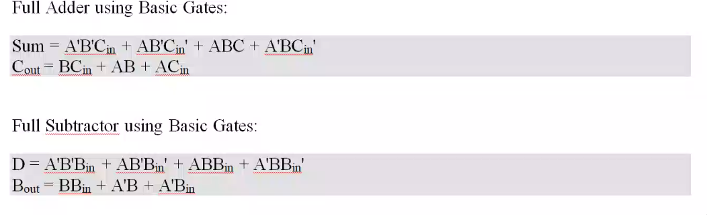

#  DSD Lab


[site](https://www.cs.drexel.edu/~jjohnson/2012-13/fall/cs281_fa12/labs/vhdlmux.html )

Aim:

1. Half Adder and Full Adder (using basic gates and universal gates).
2. Half subtractor and Full Subtractor (using basic gate and universal
gates).

Using DataFlow style of Modelling

File: Aim, Software Used, Theory, Circuit Diagram , Boolean Expression, VHDL
Codes, Waveform, Result.


Half ADDER using Basic Gates:

```
S = AB` + A`B
C = AB
```

Half Subtractor using Basic Gates:

```
D = A`B + AB`
B = A`B
```





