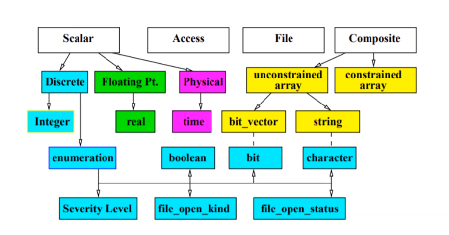
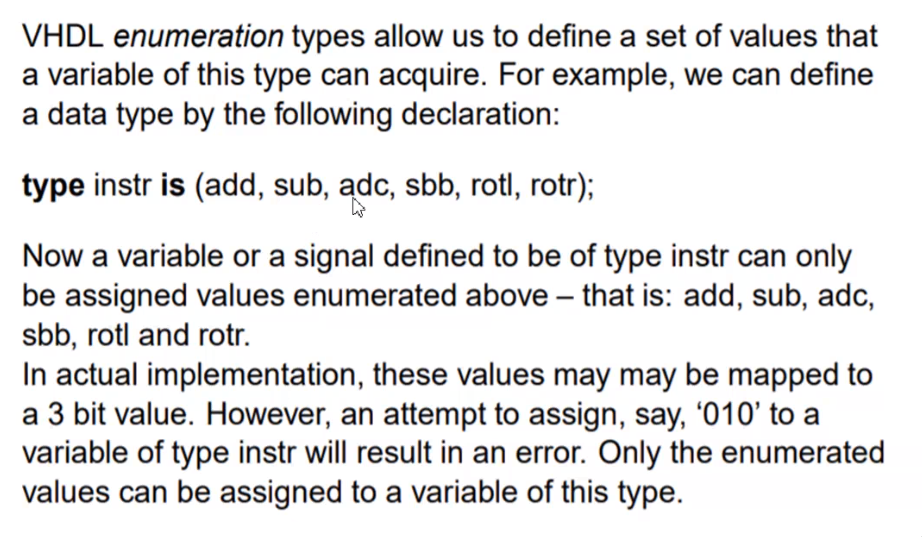
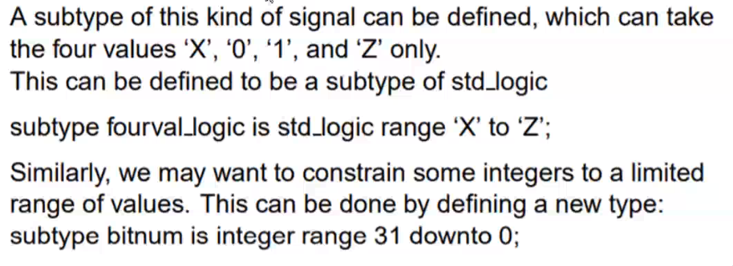
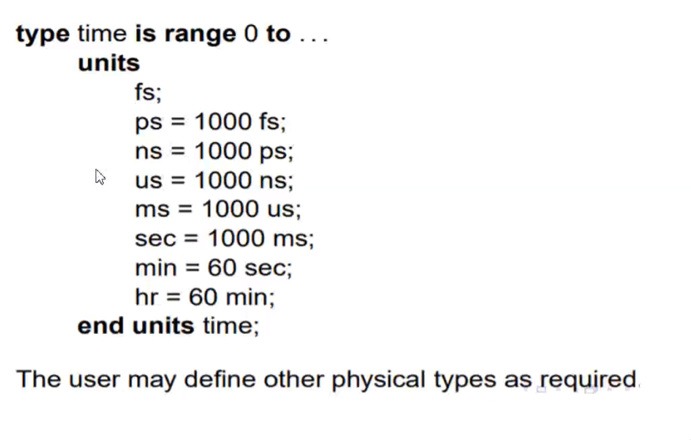
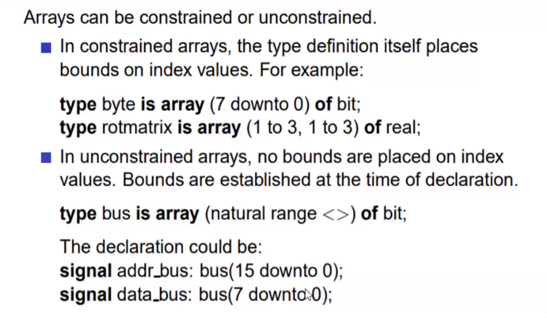

## Objects and Data Types in VHDL

VHDL defines several types of objects. These include constants, variable,
signals and files.

The types of values which can be assigned to these obejects are called data
types.

Same data types may be assigned to different object types.
For Example, A constant, a variable, and a signal can all have values which are
of data type BIT.

Declaration of objects include their object type as well as the data types of
values that the can acquire.

for signal, during allocation, present value as well as future values are
stored in the signal, since future values are also computed at time of
elaboration

For Example

>  signal Enable: BIT;


## Data Types:



```vhdl
Signal A: integer;
```

\pagebreak

## Enumeration Types



keyword type

```vhdl
type instr is (add, sub, adc, sbb, rotl, rotr);
```
### Predefined Enumeration type

type bit is
type boolean
type severity_level
type file_open_kind
type

\pagebreak

## Types and Subtypes

A signal type defined in the IEEE library is std_logic.
9 possible values.
Defined by:

 ```
 type std_logic is ('u', 'x', '0', '1', 'z', 'w', 'l', 'h', '-');
 ```



## predefined physical type: time



- other type can be resisitance

## Composite Data Type

Composite Data types are collection of scalar types;

- Arrays  could be one or multi-dimenstional
- Record like structures in C

### Arrays




## Shift Operator

- Sll (shift left)
- Srl (shift right)

- Sla (shift left arithmetic
- Sra (shift right arithmetic)

- Rol (rotate left)
- Ror (rotate right0

Example:

- "1001010" sll2 "0101000"
- "1001010" sla2 "0101000" rightmost bit filled with 0
- "1001010" sra3 filled with 1 the leftmost bit "11110001"
- "1001010" rol2 is "0101010"
- "1001010" ror3 is "0101000"

minus sign with bit

- "1001010" srl-5 perform sll5
- "1001010" sla-2 sra2
- "1001010" sra-4 sla4
- "1001010" rol-1 ror1
- "1001010" sll-5 srl5

## Operation

- "&" used for concateation

```vhdl
'c' & 'a' & 't' "cat"
```

- "*" multiplication, "/" division,  mode, rem

```vhdl
     A rem b = a - (a/b) * b
     A mod b = a - b * n
```

