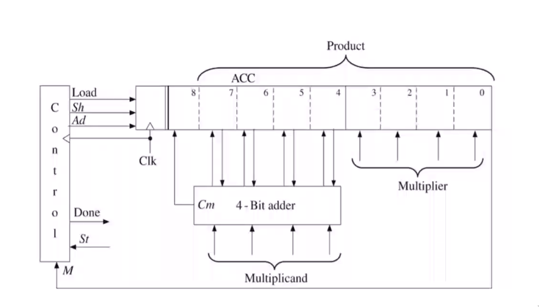

## Unit 2

## Binary Multiplier 4x4




```vhdl

```

## [bcd adder](https://care4you.in/bcd-adder/)

```vhdl
library ieee;
use ieee.std_logic_1164.all;
use ieee.numeric_std.all;

entity bcd_adder is
port(a,b : in unsigned(3 downto 0);
carry_in : in std_logic;
sum : out unsigned(3 downto 0);
carry : out std_logic);
end bcd_adder;

architecture bcd_adder_arch of bcd_adder is
begin

process(a,b)
variable temp : unsigned(4 downto 0);
begin
temp := ('0' & a) + ('0' & b) + ("0000" & carry_in);
if(temp > 9) then
carry <= '1';
sum <= resize((temp + "00110"),4);
else
carry <= '0';
sum <= temp(3 downto 0);
end if;
end process;

end bcd_adder_arch;
```
