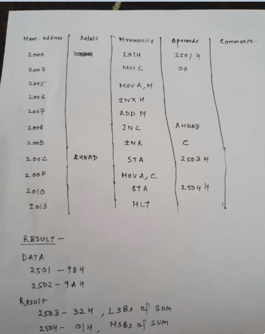

# Aim:

a. Addition of 2 8bit numbers and the result is also 8bit number.
b. Addition of 2 8bit numbers and the sum is 16bit number.

Place 05 in register B

get 05 in register A then move it to register B

load the content of the memory location f to the accumulator then transfer it to register by the content of memory locatio fc0xh is 05

LXI H, 2050
MVI C, 00
MOV A, M
INX H
ADD M
HLT

Machine cycle
T-state
Addressing mode

