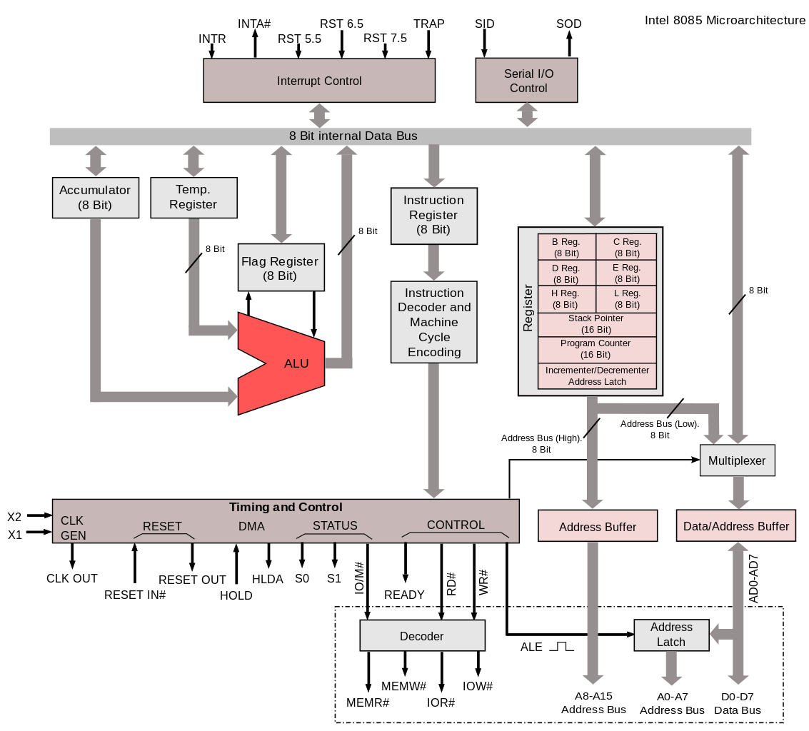
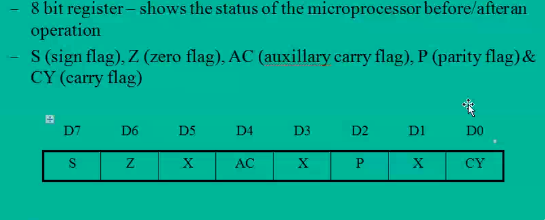

# Architecture of 8085

\pagebreak

## Can be divided into 5 groups:

1. Arithematic Logical unit Group:

	1. Accumulator:
		1. 8bit register
		2. General Purpose
	2. Temp Reg:
		1. not available for the user
		2. used internally by microprocessor
		3. Example are W, and Z
	3. Flag flip-flops
	4. Instruction Register
	5. ALU:
		1. Inputs are Accumulator and Temp reg
		2. It performs arithematic operations

2. Register Group

3. Interrupt Control Group:
	1. 5 interrupts are there and one acknowledgement

4. Serial I/O Control Group:
	1. SOD
	2. SID

5. Timing and Control Group:
	1. Instruction register:
	   	- used for internally usage
		- instruction are stored here
	2. Instruction decoder and machine cycle encoding:
		- when opcode is availabe for instruction
		- operands are not accepted
		- non programmable register
		- bit pattern is accepeted from IR
		- and sends it to Timing and Control
	3. Timing and Control:
		- Control Section
		- generates **"microsteps"** to perform the instruction
		- Clock input and sychronizing
		- communication between peripheral and 8085

\pagebreak
## Flag Register

- 8bit register
- Sign Flag, Zero Flag, Auxillary Carry Flag, Parity Flag, Carry Flag

- Carry Flag:
	- used when carry is generated
	- acts as 9th bit
	- borrow bit in difference
- Auxillary Flag:
	- Carry is genereted at lower nibble, to upper nibble then this flag is
	  set
	- used internally only
	- binary to binary conversion
	-
- Zero Flag:
	- if operation result is zero, this flag is set
- Sign Flag:
	- set if negative, reset if positive, that is for MSB bit
	- used to indicate the sign of data in accumulator
- Parity Flag:
	- used to indicate the parity of result, if the result contains even
	  no. of "1" then the flag is set, if odd the reset

\pagebreak
## Types of register

- temp: W and z:
	- used internally
	- for calculation purposes
- General Purpose: B, C, D, E, H, L:
	- to form register pair of 16bit
	- 8bit register
	- programmable by user
- Special purpose:
  	- Stack Pointer:
		- used for execution of programs
		- points to memory address to fetch next instruction
		- store the information cpu
		- works in lifo
		- 16bit address used to define starting point
		- tracks the data stored
	- Program Counter:
		- increments by one when fetching next instruction
		- at start, it set at 0
		- it is of 16bit, since 8085 contains 16 address line using
		  which any memory location can be accessed. Hence 16bit are
		  sufficient
	- Incremental/ Decrementer address latch:
		- used in co-ordination with above two
		- to increment and decrement infro
	- 16bit registers
