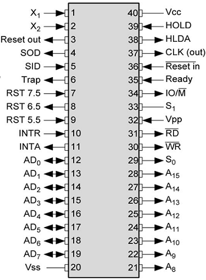

## Pin Diagram of 8085

[Link for Pins
Meaning](https://www.brighthubengineering.com/diy-electronics-devices/52160-pin-description-in-the-8085/)

\pagebreak
- 40 pin IC
- can be divided into 10 types:
	- Address Data bus 21 to 28:
		- ouptut tristate signal used as higher order 16bit signal
		- unidirection signals, only address is given by 8085 to
		  peripheral devices
		- Reset, hold, halt
	- Multiplexed Address data Bus 12 to 19:
		- input/output tristate signal, address in data
		- lower order 8bit signal
		- used as data bus later on
		- less pins are required because of multiplexing
		- demultiplexing is required which is disadvantage, hence more
		  time and circuit is required.
	- Control Signals :
		- 30th (ALE) demultiplexing of lower order data bus
		- 34 (IO/$\overline{M}$) Input/Output Memory, gives status of operation mode
		- 32 ($\overline{RD}$) READ
		- 31 ($\overline{WR}$) WRITE
		- 35 (READY) input to microprocessor from lower peripheral to faster microprocessor and synchronizes it and check if data transfer is ready
	- Status Pins : Gives Stauts of what operation is performed
		- 29 ($S_0$)
		- 33 ($S_1$)

		| S1 | S0 | Operation |
		|----|----|-----------|
		| 0  | 0  | Halt      |
		| 0  | 1  | Write     |
		| 1  | 0  | Read      |
		| 1  | 1  | Fetch     |

	- Clock Signal:
		- 37 Clock out input signal used as internal clock
		- 1 : connected to crystal
		- 2 :
	- Interupt Signal:
		- 6 Trap: level high signal, edge triggered, level triggered,
		  highest priority, non maskable interrupt
		- 7 RST 7.5: Restart interuptts, active high,edge or level
		  triggered, maskable interrupt
		- 8 RST 6.5
		- 9 RST 5.5
		- 10 INTR: Interrupt request
		- 11 $\overline{INTA}$
	- Serial Signal :
		- 5 SID: input signal for software contro
		- 4 SOD: output signal
	- DMA Request Signal: Direct memory access
		- 39 HOLD: active high, used by other control to access data
		  signals and address signals, input
		  signal
		- 38 HLDA: acknowledgment signal to HOLD
	- RESET Singal:
		- 3 RESET OUT:
		- 35 RESET IN: used to clear program counter to 00000
	- Power Supply:
	  	- VCC: 5v
		- VSS: Ground
